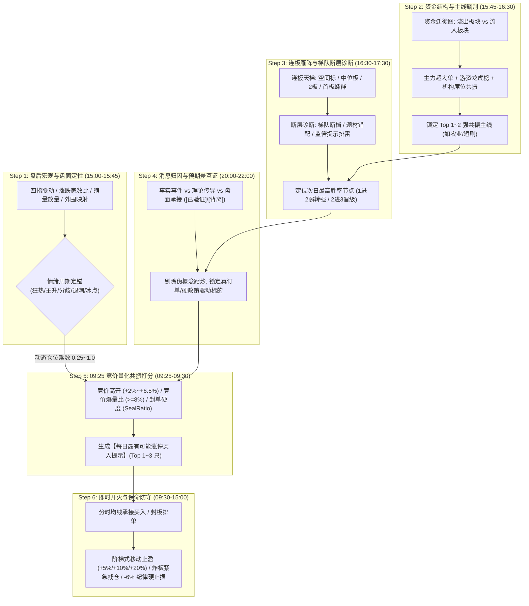

# 🦅 每日涨停确定性捕捉与买入提示决策系统 (Daily Limit-Up Alpha Engine)
## —— 融合全景宏观定性、资金迁徙共振与连板天梯雁阵的实战思考体系

> **版本规范**：Release-Ready v2.0  
> **核心定位**：专精 A 股超短线涨停板（首板突破、1 进 2 弱转强、2 进 3 晋级加速、空间板接力）的确定性捕捉与买入决策体系。  
> **设计对标**：融合 AlphaBot 宏观资金复盘思考范式与 Hermes/Antigravity 毫秒级盘口执行闭环。

---

## 一、 系统设计哲学与思考推演闭环

散户在追逐涨停板时的最大痛点在于：**“看涨停去追，往往买在炸板退潮之巅；看跌不敢买，往往错过主线分歧转一致的黄金卡位”**。

本系统摒弃传统单一个股的技术指标（如单纯突破均线或指标金叉），借鉴机构级复盘推演框架，构建**“宏观气象 -> 资金迁徙 -> 题材归因 -> 连板雁阵 -> 竞价抢筹 -> 阶梯锁利”**的六阶金字塔思考闭环：



---

## 二、 六阶推演流程与量化决策模型

### 第一阶：宏观气象与情绪周期定锚（确定当日总攻守基调）

在每天寻找涨停股之前，必须先回答第一个问题：**“今天是大盘给肉吃，还是大盘在砸盘？”**

1. **量价指数矩阵**：
   - **四指表现**：上证指数、深证成指、创业板指、科创50。重点关注**分化度与均线位**（如创指失守年线、科创失守半年线即预警成长股失血）。
   - **量能环境**：全市场成交额 $\ge 2$ 万亿为增量活跃；环比萎缩超 500 亿为“存量博弈高低切”。
   - **市场广度**：上涨家数 / 下跌家数比；涨停数与跌停数。
2. **情绪周期数学模型**：
   $$Score_{sentiment} = 0.35 \times \frac{N_{limit\_up}}{80} + 0.25 \times \frac{GainRatio - 0.5}{0.5} + 0.20 \times \frac{\Delta Volume}{1000} - 0.20 \times N_{limit\_down}$$
   - **狂热期（Euphoria）**：涨停 $>70$ 只、跌停 0 只，微盘股连创新高。**策略：警惕高位分歧，只做低位补涨与首板回封**；
   - **主升期（Hot）**：主线清晰、成交放量、指数共振。**策略：全仓出击，主攻连板天梯核心龙头**；
   - **分歧期（Divergence）**：指数分化、高位妖股出监管风险、5 板断层。**策略：防守为主，严禁接力高位，精做 1 进 2 弱转强，总仓 $\le 50\%$**；
   - **退潮期（Cooldown）**：涨停跌破 30 只、连板高度压缩至 3 板以下。**策略：收紧仓位乘数至 0.25，只看不动**；
   - **冰点期（Ice）**：恐慌杀跌、双指数大跌。**策略：等待尾盘恐慌盘衰竭做反抽，禁止追板**。

---

### 第二阶：资金迁徙图谱与主线强度锁定（锁定资金抱团方向）

涨停是个股资金意志的极限表达，**脱离板块主线的孤票涨停多为一日游陷阱**。

1. **资金迁徙矩阵**：
   - **流出端（被撤离）**：主力连续 3 日净流出、百亿成交权重跌破分时均线（如半导体板块单日净流出 12 亿）；
   - **流入端（被抱团）**：主力净流入居前、申万一级行业涨幅 Top 3、龙虎榜游资重仓买入。
2. **资金共振评分算法**：
   对于候选板块 $S$，计算其综合动量评分：
   $$Score_{sector}(S) = 0.40 \cdot R_{gain}(S) + 0.35 \cdot Flow_{norm}(S) + 0.25 \cdot \frac{N_{limit\_up}(S)}{\sum N_{limit\_up}}$$
   - 系统每日收盘仅锁定 $Score_{sector}$ 最高的 **Top 1~2 个主线题材**（例如：粮食/农业链、AI应用/短剧传媒）。非主线板块的杂毛涨停直接剔除。

---

### 第三阶：连板雁阵图与断层诊断（寻找阻力最小的晋级节点）

涨停接力的精髓在于**“避开监管枪口，吃足空间溢价”**。

1. **连板梯队绘制（雁阵模型）**：
   - **空间标（天花板）**：6~7 连板（如海鸥住工 7 板、万向德农 6 板）；
   - **高位中军**：4~5 板（如新赛股份 4 板）；
   - **中位攻坚**：2~3 板（如时代出版 3 板、欢瑞世纪 2 板、中广天择 2 板）；
   - **蜂群基座**：首板（如神农种业、登海种业等 70 只首板）。
2. **断层诊断机制（Gap Audit）**：
   - **梯队断层**：若出现 7板 $\rightarrow$ 6板 $\rightarrow$ 4板，中间 5 板缺失，说明中高位筹码断层，资金不敢往上顶高度，高位股随时面临补跌；
   - **题材错配**：最高标（如 7 板家居地产）与当前市场吸金最强主线（农业/短剧）不一致，说明最高标是情绪孤勇者，非主线龙头；
   - **监管劝退信号**：高位连板集体发布严重异动公告，次日往往诱发集体踩踏。
3. **确定性甜点位（The Sweet Spot）**：
   - **分歧日最优解：首板 1 进 2 弱转强**。首板个股经历充分换手，次日一旦超预期高开抢筹，极易被主线资金合力推上二板，封板率高达 85% 以上，且远离监管异动红线。
   - **主升日最优解：中位 2 进 3 晋级加速**。主线题材确认后，2 进 3 标的将承接前排龙头溢出资金，成为接力先锋。

---

### 第四阶：消息归因与预期差互证（剔除假概念，锁定硬逻辑）

不是所有利好都能封涨停，**只有产生“超预期差”的利好才能驱动连续涨停**。

| 催化剂分类 | 判定标准 | 涨停潜力定性 | 实战处理法则 |
| :--- | :--- | :---: | :--- |
| **I 类：不可逆产业硬催化** | 国际大宗商品价格创三年新高、国家级突发顶层政策、重大产业量产订单 | 🔥 **极高 (90%+)** | 龙头开盘直接挂涨停价抢筹，后排找分时回踩均线低吸 |
| **II 类：重大商业模式/爆款产品** | 首部 AIGC 长剧上线破千万、大模型取得突破性商用突破 | 🔥 **高 (80%+)** | 寻找具备知识产权或内容库的 2 板先锋加速打板 |
| **III 类：常态化行业消息** | 行业展会召开、常规补贴、非独家框架协议 | ⚠️ **中低 (40%)** | 极易冲高回落走“骗炮”多头陷阱，严禁开盘追高 |
| **IV 类：外围逆风反向压制** | 美股同类科技大跌（费半跌超2%）、美债收益率飙升 | ⛔ **极低 (0%)** | 理论利好被宏观利空对冲，全线回避 |

---

### 第五阶：09:25 集合竞价量化共振模型（开火信号生成器）

每天 09:25:00~09:25:05，交易所第一笔撮合成交价格出炉。**竞价盘口是多空主力亮出底牌的唯一时刻**。

#### 1. 弱转强与接力抢筹核心指标

- **指标 1：开盘溢价率 ($OpenPct$)**
  $$+2.0\% \le OpenPct \le +6.5\%$$
  - $OpenPct < +2.0\%$：抢筹力度不足，弱转强失败，放弃；
  - $OpenPct > +7.5\%$：开盘位置过高，日内盈亏比极差，一旦炸板单日回撤高达 15%，放弃。
- **指标 2：竞价爆量比 ($AuctionRatio$)**
  $$AuctionRatio = \frac{\text{09:25 集合竞价成交量}}{\text{前一交易日全天成交量}} \ge 8.0\%$$
  且竞价成交金额 $\ge 1500$ 万元（小盘股 $\ge 1000$ 万元），证明主力大单真金白银真抢筹，而非几百手诱多虚张声势。
- **指标 3：封单硬度量化比率 ($SealRatio$)**
  针对一字板或秒板候选：
  $$SealRatio = \frac{\text{涨停板封单买入金额}}{\text{股票自由流通市值}} \times 100\%$$
  - $SealRatio \ge 5.0\%$ 或封单 $\ge 1$ 亿元 $\rightarrow$ **“铁板”**（确定性封死，无脑跟进）；
  - $2.0\% \le SealRatio < 5.0\%$ $\rightarrow$ **“强板”**（正常跟进）；
  - $SealRatio < 1.0\%$ 且封单 $< 2000$ 万元 $\rightarrow$ **“诱多弱板”**（坚决不买）。

#### 2. 涨停买入提示生成打分表 (L-Score)

$$L\text{-}Score = 0.30 \cdot S_{auction} + 0.25 \cdot S_{sector} + 0.20 \cdot S_{ladder} + 0.15 \cdot S_{catalyst} + 0.10 \cdot S_{seal}$$

- 凡综合 $L\text{-}Score \ge 80$ 分者，系统于 **09:25:10 秒级输出买入提示卡片**。

---

### 第六阶：即时报单与保命防守矩阵（锁死盈利，截断亏损）

买入只是交易的起点，**防守才是量化系统能够长期稳定盈利的核心壁垒**。

```
                    ┌──────────────────────────────────────────────────────────┐
                    │                      开盘提示买入                         │
                    └──────────────────────────┬───────────────────────────────┘
                                               │
                                               ▼
                    ┌──────────────────────────────────────────────────────────┐
                    │               阶梯式移动止盈矩阵 (Trailing Lock)          │
                    ├──────────────────────────────────────────────────────────┤
                    │ • 浮盈 >= +20% ：回撤破 +14% 刚性锁定，落袋为安           │
                    │ • 浮盈 >= +10% ：回撤破 +5%  刚性锁定，锁定波段利润       │
                    │ • 浮盈 >= +5%  ：止损线上移至 成本价+0.5% (保本保息)       │
                    └──────────────────────────┬───────────────────────────────┘
                                               │
                                               ▼
                    ┌──────────────────────────────────────────────────────────┐
                    │               炸板最高价防守 (Explode Defense)            │
                    ├──────────────────────────────────────────────────────────┤
                    │ • 触及涨停后炸板回落 >= 3.0% ：监控 15 分钟回封状态        │
                    │ • 15 分钟内不回封 ：减仓 50% 规避瀑布式杀跌               │
                    │ • 跌破分时均线超 20 分钟 ：市价全量清仓                   │
                    └──────────────────────────┬───────────────────────────────┘
                                               │
                                               ▼
                    ┌──────────────────────────────────────────────────────────┐
                    │               刚性纪律硬止损 (Hard Stop)                  │
                    ├──────────────────────────────────────────────────────────┤
                    │ • 任何持仓跌破成本价 -6.0% ：无条件市价清仓，永不扛单     │
                    └──────────────────────────────────────────────────────────┘
```

---

## 三、 实战输出模版：每日涨停决策提示卡（以 2026-09-02 盘前为例）

```markdown
🎯【Antigravity 每日涨停潜力决策提示卡 | 2026-09-02 盘前】
━━━━━━━━━━━━━━━━━━━━━━━━━━━━━━━━━━━━━━━━━━━━━━━━━━━━━━━━
【大盘定性】：缩量高低切日（情绪得分: 58/100，分歧日前夜，仓位上限: 45%）
【核心主线】：① 粮食/种植业（极强）  ② AI应用/数字媒体（走强）
【回避方向】：半导体/电子硬件/高位 6~7 板妖股（外围杀跌 + 盘后监管风险）
────────────────────────────────────────────────────────
🔥【每日精选最有可能涨停标的 (Top 3)】：

1. 登海种业 (002041.SZ) | 题材: 粮食种植/转基因 | 战法: 首板 1 进 2 弱转强
   • 入场条件: 09:25 竞价高开 +2.5%~+4.8%，竞价成交额 > 2000 万
   • 核心逻辑: 国际粮价新高硬催化，昨日万向德农 6 板打开空间，登海低位放量首板，最具接力潜质
   • 目标动作: 09:30 开盘分时均线回踩即买；若高开 < +1.5% 或板块大幅低开则放弃

2. 掌阅科技 (603533.SH) | 题材: AI应用/短剧出版 | 战法: 2 进 3 晋级加速
   • 入场条件: 09:25 竞价高开 +3.0%~+5.5%，且 09:35 前放量封板
   • 核心逻辑: 芒果超媒 20cm 创百亿成交引领板块，中位出版股时代出版已 3 板，掌阅具备极佳辨识度
   • 目标动作: 封板瞬间排板或 9:31 分时冲高确认回踩低吸；若芒果超媒大跌超 3% 则放弃

3. 冠农股份 (600251.SH) | 题材: 农业/糖棉产业 | 战法: 首板放量强接力
   • 入场条件: 09:25 超预期高开 +3.0%，竞价放量比 > 8%
   • 核心逻辑: 逆市放量脱离中枢，资金逆大盘流入超 1.2 亿元，形态呈现缠论标准三买离开段
   • 目标动作: 开盘直挂市价申报 20% 仓位

────────────────────────────────────────────────────────
🛡️【保命红线】：
• 若海鸥住工/万向德农开盘秒跌停或炸板，立即阻断所有买单，执行防守程序。
• 组合刚性硬止损线：成本 -6.0%；浮盈达 5% 立即启动保本锁。
━━━━━━━━━━━━━━━━━━━━━━━━━━━━━━━━━━━━━━━━━━━━━━━━━━━━━━━━
```
