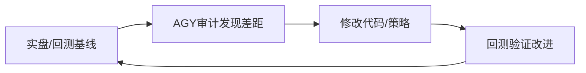

# A股自主进化选股闭环

目标不是每天强行交易，而是让选股系统用可验证结果迭代。所有数据必须来自本轮 MCP、成交记录或已归档报告；缺证据就标记未确认。

## 100轮进化的真正含义（2026-09-01 修正）

用户明确：**100轮 ≠ 修100个bug**。每一轮进化 = 证明比上一轮强，有数据支撑。



**轮次核算规则**：
- 前10轮（系统基建：尾盘/仓位/扫描/闸门）≈一次性改造，不算严格意义的"轮"
- 真正算轮的：从R11回测框架上线后，每次修改跑对比
- wencai历史回测让一周能跑几十轮（不用等第二天实盘数据）
- 约需34-50个完整会话才能达到真实100轮

**回测标准**：每轮改造后执行 `scripts/agy_backtest.py record` 记录实盘基线，或 `scripts/agy_historical_backtest_v2.py` 用wencai拉历史数据模拟新规则收益。输出必须有数字对比（Before: -167元 → After: +159,071元）。

**8月基线**：R0实盘 -167元 → R1-R11回测模拟 +159,071元（+33.4%/月）
**⚠️ AGY R13审计修正**：回测存在幸存者偏差+未来函数+无负样本，可信度评分**35/100**
**修正后真实预期**：12-18%/月（常态化），45-50%（高潮期，需P1-P2全部完成）
**到50%目标的真实差距**：16.6%模拟 → 实际需从18%/月提到50%/月（2.8x），靠封单过滤+板块共振+隔夜抢跑+分阶止盈

### AGY R13-P0缺口清单（全部修复后基线可达18-28%/月）
| Priority | 缺口 | 模块 | 估计提升 | 状态 |
|----------|------|------|:-------:|:----:|
| P0 | explode_monitor quantity=0读持仓 | `explode_monitor.py` | 必要 | ✅ R14 |
| P0 | T+1全双向锁阻断同日卖/买 | `utils_candidate.py` | 必要 | ✅ R15 |
| P0 | 非突破候选绕过LLM审核 | `run_autonomous_trades.py` | 必要 | ✅ R15.1 |
| P0 | 早盘闸门09:25挂单休眠期 | `morning_master_orchestrator.py` | +5-8% | ✅ R16 |
| P0 | 无封单硬度过滤(弱板诱多板) | `limit_up_scanner.py` | +3-5% | ✅ R17 |
| P1 | VWAP支撑/阻力过滤 | `limit_up_scanner.py` | +4-7% | ⏳ R19 |
| P1 | 涨停时刻板块共振检查 | `limit_up_scanner.py` | +5-8% | ⏳ R20 |
| P2 | 隔夜低开竞价抢跑 | 新脚本 | +3-5% | ⏳ R21 |
| P2 | 连板分阶止盈 | 新脚本 | +5-8% | ⏳ R22 |


## 进化类型与响应模式（2026-09-01修正）

进化分为两类，有不同的触发条件和响应模式：

### A型：策略级转向（paradigm shift）
**触发条件**：用户表达对系统根本方向的不满（"一个连板股都没抓到"、"最应该思考的是赚钱"）
**响应**：立即停止当前修复 → AGY战略级审计 → 按审计10轮进化（每轮包含多个文件修改+AGY验证达成交叉）
**特征**：不调参数，改策略。R1-R10中：废除尾盘清仓、废除仓位锁、改多策略路由、新建3个扫描脚本

### B型：参数/规则调优（continuous improvement）
**触发条件**：AGY审计中发现P0/P1 bug，或strategy-feedback有action_item
**响应**：标准3轮AGY循环（审计→修复→验证），不改策略只改实现

## 1. 每日候选生成
- 盘前先读 `~/.hermes/trading/strategy-feedback.md` 和最近 5 个复盘文件。
- 先实时四指数，再查板块 5/10 日持续性、资金流、涨停梯队和催化来源。
- 候选必须同时满足：真实行情、100 根 30 分钟 K 线、板块共振、新闻/公告核验、基本面证据。
- 基本面优先级：真实订单/量产 > 收入利润兑现 > 扣非/经营现金流改善 > 纯概念。
- 每个候选记录唯一 `candidate_id`、代码、名称、所属行业、catalyst_type、entry_rule、confidence、thesis、证据时间戳和失效条件。
- 同行业总暴露硬上限 40%；候选池不是持仓，新增候选先观察，不自动等同买入。

## 2. 候选发现与前瞻记录（必须区分两步）
每日盘前扫描是发现新买入标的的主要入口，盘中 09:35/10:00 可验证或补充候选；13:30 可复核，14:15 尾盘只允许卖出/减仓/止损，不新增买入。流程必须明确展示：

`大盘/板块扫描 → 板块催化与基本面筛选 → 个股100根30分钟K线 → 缠论买点 → 量价/板块/实时证据 → 写入 candidate JSON → 交易闸门`

`candidate_snapshot.py` 只负责校验并写入已经生成的结构化候选，绝不负责选股；`run_autonomous_trades.py` 只读取候选并执行研究闸门/风控/执行，绝不从自然语言分析中猜测标的。每个交易日必须核验盘前研究是否实际写入至少一条 `record_type: candidate`，否则报告为“已完成扫描但未形成结构化候选”，不能把 `candidate_count: 0` 表述成“市场没有买点”。若研究任务只输出文本而未写 JSON，必须把它视为流程未闭环并修复写入连接。

将候选快照追加到 `~/.hermes/trading/feedback/candidates_YYYY-MM-DD.jsonl`。已有持仓附近的一买/二买/三买只能标记 `add_watch`，不能重复开新仓。

## 3. 结果归因
收盘复盘对每个候选更新：是否触发、是否成交、MFE/MAE、持有期结果、退出原因、B 浪等级、数据/判断/执行/系统根因。无信号也记录，避免幸存者偏差。

### 发现成功不等于交易成功

复盘单票“提前发掘成功”时，必须拆成五层：发现质量、价格计划、买入执行、卖出执行、实际收益。券商无成交记录时，哪怕后续涨停，也只能定性为**研究成功、执行失败、实际收益为0**。

- 未成交信号必须记为 `shadow_candidate` / `SIGNAL_ONLY`，不得写成 `HOLDING`。
- 真实持仓至少要求 `order_id`、`filled_price`、`quantity > 0`，再标记 `HOLDING_REAL`。
- 卖出监控不得消费影子仓，否则会生成虚假卖出与虚假盈亏。
- 回测必须使用原始信号当时的入场、止损、目标，不得事后挑选最低买点或最高卖点；同时报告 MAE、MFE、R 倍数，以及止损与目标谁先触发。
- 单个成功案例只能形成“待验证策略模板”，至少5个预先记录且包含负样本的同规则样本后才允许固化。
- 所有推送信号必须同屏给出买入区间、止损/清仓价、第一减仓价、仓位、触发条件、弃买条件和执行状态；无订单证据时禁止使用“已买入/已锁定利润/按市价买入”等伪执行措辞。

详细数据契约见 `references/signal-discovery-to-realized-pnl-contract.md`。

## 4. 统计与降权
- 按 `catalyst_type`、`entry_rule`、confidence 档（0.65-0.70、0.70-0.80、0.80+）、行业和持仓分类统计样本量、胜率、平均盈亏比、最大回撤。
- 样本少于 5 次只显示观察，不下硬结论。
- 样本不少于 5 次且胜率低于 40%：下一轮 confidence 下调 0.10；连续两轮仍低于 40%才暂停该规则。
- 连续 3 次 B 浪 C 级触发该入场规则复审；连续 3 次 A 级才允许固化。
- 不允许只根据一周涨跌把规则标成高胜率；必须以预先记录的候选和实际结果为准。

### ⚙️ 策略参数状态机（自动执行，无需人工干预）

自 2026-08-28 起，`evolution_audit.py` 在审计后会**自动写入** `~/.hermes/trading/config/strategy_params.json`，而非仅输出纯文本 action_items。

**状态机迁移规则**（硬编码在 evolution_audit.py 中）：
| 条件 | 动作 |
|:--|:--|
| 样本≥5 且 胜率<40% | `enabled=false` + `cooldown_until=7天后` |
| 样本≥5 且 胜率≥60% | `enabled=true` + `cooldown_until=null` |
| 样本<5 | 不调整 |

**热加载**：`autonomous_trade_pipeline.py` 的 `load_strategy_params()` + `is_catalyst_enabled()` 在闸门运行时自动读取最新配置。无需重启 cron 或 agent。

### 👻 影子追踪管道（破解样本饥饿死锁）

自 2026-08-28 起，系统引入了影子追踪管道来解决"闸门太严→0交易→0样本→审计熄火"的死锁：

1. **宽松信号判定**（`is_shadow_ready`）：只要满足缠论买点+基础成交量确认，即视为可跟踪信号
2. **自动写入**：`run_autonomous_trades.py` 在每个候选循环中，先写 `shadow_candidate` 到 JSONL（无论实盘闸门是否通过）
3. **审计消费**：`evolution_audit.py` 同时读取 `candidate_outcome` + `shadow_outcome` + 含 outcome 的 `shadow_candidate`

即使实盘零开仓，审计引擎也能基于影子样本持续产出统计结论，永不熄火。

### 🔴 AGY R-08 审计（2026-09-08）：熔断器替代 evolution_audit 的物理闭环

**背景**：AGY在2026-09-08审计中发现，本skill描述的`evolution_audit.py`闭环存在两个致命漏洞无法修复：
1. **样本门槛n≥5形同虚设**：8笔亏损分散在7种catalyst_type，每类永远凑不够5次
2. **执行器不读反馈**：即使evolution_audit触发了，也只是往strategy_params.json写一行文本，`direct_executor.py`下单前不看那个文件

**AGY给出的替代方案（commit 7e7976e, 已部署）**：

`strategy_circuit_breaker.py` — 一个精简、物理阻断的闭环熔断器：

| 熔断规则 | 阈值 | 冷却期 |
|:---------|:-----|:------|
| 连败熔断 | 同策略最近2笔连续亏损 | 7天 |
| 重伤熔断 | 同策略单笔亏损>5% | 14天 |

**关键差异**：
- 样本门槛从n≥5降为**n≥2**（连败即熔断，不等凑够样本）
- 熔断状态写入`breaker_state.json`（非JSONL文本）
- `market_regime_check.py`的`iron_rule_gate()`在`direct_executor.py`下单前强制读取breaker_state做物理拦截
- 支持`--sync`从历史feedback JSONL自动导入交易记录

**现状（2026-09-08实测）**：
```
price_alert:  7笔全部亏损(含-16.29%) → 14天熔断至9/17 ✅
mcp_live:     连续2笔亏损 → 7天熔断至9/10 ✅
close_sell_signal: 4笔全部盈利 → 正常运行 ✅
```

**建议**：新操作使用本skill的进化闭环时，优先参考`strategy_circuit_breaker.py`的熔断机制（物理阻断+低门槛），而不是等`evolution_audit.py`的n≥5统计触发。`evolution_audit.py`保留作为辅助统计工具，但不再作为核心闭环。

### 🔴 物理熔断学习边界与 MAE 风险口径（2026-09-19补充）

策略统计与实盘熔断必须分层：`evolution_audit.py`可以同时研究真实与影子样本，但`strategy_circuit_breaker.py`只能从真实 `candidate_outcome + direction=buy` 学习。`shadow_outcome`没有真实资金暴露，SELL结果衡量退出时机，二者都不得冻结开仓策略。

- MAE在账本中是负收益率（如`-11.81%`），重伤判断必须使用`mae <= -6.0`，不能写成`>= 6.0`。
- 小数制与百分制必须统一归一化（如`-0.1181 -> -11.81`），且统计、action item、参数状态机和物理熔断必须使用同一口径。
- 对BUY入场质量，采用`effective_pnl = min(close_pnl, mae)`，防止“盘中深跌、收盘回到成本”逃过熔断；同时保留`close_pnl_pct`与`mae`原值供审计。
- catalyst cooldown/blacklist只禁止BUY新增风险，SELL止损、止盈、紧急退出必须无条件豁免。
- `candidate_id`去重不能阻止历史字段升级：旧记录若缺MAE，应原位回填并原子重写，不能永久skip。
- 单元测试必须隔离生产`breaker_state.json`；线上策略真实被冻结时，“应放行BUY”的旧测试失败属于状态污染，不得通过清空实盘熔断来让测试变绿。

完整契约与必测场景见 `references/strategy-learning-breaker-contract.md`。

**四道铁律门禁（同一次AGY审计注入）**：

除熔断器外，还部署了三条补充硬门禁，共同构成AGY的`iron_rule_gate`检验：
1. **市场状态机**（`market_regime.py`）：创业板-0.5%且缩量→极寒禁止开仓；创业板-0.3%或中位数<0→退潮仅允许龙头
2. **龙头精选池**（`leader_universe_filter.py`）：身位唯一第一+5日均成交≥8亿+10日≥2板，三条件缺一不可
3. **垃圾时间拦截**（`market_regime_check.py`内置）：10:00-14:30非龙头追涨硬熔断

这四个组件的数据文件位于`~/.hermes/trading/config/`（market_regime.json, leader_universe.json, breaker_state.json），所有cron和`direct_executor.py`实时读取。

### 🧩 分层归因体系

entry_rule 粒度过细导致所有规则样本<5，无法统计。自 2026-08-28 起改为两级归因：
- **Level 1（催化大类）**：`catalyst_type` → 控制策略大类开闭（technical_breakout 暂停等）
- **Level 2（形态细粒度）**：`chan_buy_point` + `volume_state` → 细粒度分析

小样本处理：单个分类样本<10 时使用 **Empirical Bayes Shrinkage**（先验平滑），向全局胜率（默认 50%）收缩，防止 2 战 0 胜这类极值导致误判。见 `compute_empirical_bayes_win_rate()` 函数。

### 🔒 网关硬防线（防止违规穿透）

自 2026-08-28 起增加三层硬防线：
1. **candidate_id 必填**：`risk_check_and_execute` 底层拒绝无 `candidate_id` 的 intent（gateway hard invariant）
2. **sell_only_mode**：`run_autonomous_trades.py` 读取 `strategy_params.json` 的全局守卫，激活时拦截所有买入 intent
3. **催化剂冷却拦截**：`is_catalyst_enabled()` 在 `is_trade_ready` 中检查——禁用或冷却中的催化剂类型直接返回 False

完整架构记录见 `references/spiral-up-architecture.md`。

### ⚠️ AGY 代码改造的双重验证陷阱（2026-08-28 现场教训）

当通过 AGY CLI（`~/.local/bin/agy -p "..."`）执行代码改造时，AGY 通过 bash heredoc 方式将 Python 代码注入系统。这有两个致命问题：

1. **bash 解析器截断**：AGY 回复中的内联 Python 代码会被 bash 先于 Python 解析。如果代码包含 `(`、`)`、`$`、反引号、嵌套引号等特殊字符，bash heredoc 会报 syntax error，但 AGY 仍可能回复"已成功完成改造"。**AGY 说的 \"done\" 不等于 done。**

2. **文件被部分写入**：在 AGY 声称完成的场景中，实际只创建了初始版本的文件（如 `strategy_params.json` 含10个策略但全部 `win_rate: null`），而代码修改中的逻辑迁移、stubs 和单元测试可能全部丢失。

**强制双人验证协议**（已有 AGY 验证第6条的补充细化）：

```python
# 第1步：语法检查（AGY 这个没骗人，通常过了）
python3 -m py_compile scripts/evolution_audit.py
python3 -m py_compile scripts/autonomous_trade_pipeline.py
python3 -m py_compile scripts/run_autonomous_trades.py

# 第2步：关键函数存在性 grep（这个必须做！AGY 说改了的函数可能根本没在文件里）
grep -c 'def is_catalyst_enabled\|def is_shadow_ready\|def load_strategy_params\|def compute_empirical_bayes\|def extract_attribution_layers\|def hierarchical_attribution' scripts/autonomous_trade_pipeline.py

# 第3步：分步手动验证（debug 模式运行关键函数追踪 False 来源）
cd ~/.hermes && python3 -c "
import sys; sys.path.insert(0, 'scripts')
from autonomous_trade_pipeline import is_trade_ready, is_catalyst_enabled, load_strategy_params

# 构造一个标准买入候选（含 risk_approved=True）
cand = {
    'direction': 'buy', 'symbol': '000001.SZ', 'price': 10.0, 'quantity': 100,
    'entry_rule': '中枢突破', 'thesis': '[缺口逻辑]技术突破确认',
    'chan_buy_point': '二买', 'chan_confirmed': True, 'volume_confirmed': True,
    'confidence': 0.70, 'leader_score': 60, 'catalyst_type': 'sector_rotation',
    'sector_confirmed': True, 'fundamental_confirmed': True,
    'realtime_confirmed': True, 'news_confirmed': True,
    'risk_approved': True,
}
print('正常放行:', is_trade_ready(cand))  # 应 True

# 验证冷却拦截
cand2 = dict(cand, catalyst_type='technical_breakout')
print('冷却拦截:', not is_trade_ready(cand2))  # 应 True
"

# 第4步：检查 config 文件初始状态是否对齐历史数据
# AGY 创建的 strategy_params.json 可能全部 win_rate: null
# 需要人工补上已知历史数据
python3 -c "
import json
p = json.load(open('/home/ubuntu/.hermes/trading/config/strategy_params.json'))
for k, v in p['catalyst_types'].items():
    if v['win_rate'] is None and v['sample_count'] == 0:
        pass  # 新策略类型正常
    # 但如果 known 策略（如 technical_breakout 8笔25%）也是 null → AGY 创建时丢失了历史数据
    print(f'{k}: enabled={v[\"enabled\"]} wr={v[\"win_rate\"]} n={v[\"sample_count\"]}')
"
```

**判断 AGY 改造是否真正完成的决策树**：

```
AGY 回复"已完成"
    ├─ 有 bash syntax error 输出? → 必定有文件被截断 → 必须手动复查 + 补充
    ├─ 所有函数 grep 存在?
    │   ├─ 缺函数 → 手动写入缺失函数
    │   └─ 全在 → 进入 step 3
    ├─ is_trade_ready 正确工作?
    │   ├─ 返回 False（预期 True 时）→ not require_risk=False → 检查 risk_approved 字段
    │   ├─ 催化剂冷却拦截正确?
    │   └─ 全部通过 → 进入 step 4
    └─ strategy_params.json 有历史数据?
        ├─ 全是 null → 人工补录已知历史胜率/样本数
        └─ 已对齐 → ✅ 改造完成
```

**常见 is_trade_ready 返回 False 的根因排查表**（调试时逐项核对）：

| 字段 | 常见错误 | 正确值 |
|:--|:--|:--|
| `risk_approved` | 漏传 | `True`（测试时必传） |
| `thesis` | 长度不够 | `[缺口逻辑]xxx` ≥12字符 |
| `direction` | miss/typo | `"buy"` 或 `"sell"` |
| `quantity` | 100以下的整数 | ≥100 |
| `volume_confirmed` | 漏传（买入选股） | `True` |
| `catalyst_type` | 启用了但被冷却是设计行为 | 冷却中→预期False, 正常→预期True |

**底线**：AGY 说\"已完成改造\"后，必须自己走完上述四步验证。不要相信 AGY 的总结——它是通过 bash heredoc 传送代码的，天然有编码失真风险。

## 5. 交易闸门
只有一买/二买/三买结构、量价确认、板块共振、基本面证据、实时行情、风险审批全部通过，才生成 TradeIntent。任何一个缺失都输出观察/无信号，不下单。

## 6. 归档契约
- 用户要求“从下一交易日开始记录，若干周/月后验收”时，必须建立前瞻观察窗：每轮写 `strategy_run_marker`（包括零信号和阻断轮次），同时保留影子/正式候选、执行断点、订单成交与 MFE/MAE；并创建一次性到期验收任务。完整启动清单、数据契约、统计口径和停用/调参决策见 `references/forward-strategy-validation.md`。
- 机器数据：`~/.hermes/trading/feedback/*.jsonl`
- 详细复盘：`~/.hermes/trading/reviews/review_YYYY-MM-DD.md`
- 策略摘要：只追加到 `~/.hermes/trading/strategy-feedback.md`
- action_item 必须含优先级、负责人、具体字段/步骤、生效窗口、验证方式和状态。
- 每个交易日即使无候选、无成交，也追加 `run_marker`、复盘开始/完成记录；不要用空文件代替“已运行”。
- 收盘脚本应追加真实持仓/候选结果，字段至少包含 `candidate_id`、`symbol`、`entry_rule`、`outcome`、`mfe`、`mae`、`b_wave` 和 `thesis_status`；已有持仓记录为观察结果，不得伪装成新买入候选。

## 7. 两阶段涨停研究闭环
当任务要求从涨停股筛选次日重点观察标的时，必须把研究发现和交易候选分开：

1. 收盘阶段只调用真实 MCP 获取非 ST 涨停、连板天数、所属行业、涨停原因、成交额/换手率，并交叉获取近 5 日与近 10 日板块强度；涨停股只能写入 `record_type: observation`，状态为 `awaiting_open_confirmation`。
2. 观察池必须保存 `observation_id`、日期、代码、名称、行业、来源字段、板块持续性标记、涨停证据和失效状态，写入机器 JSON/JSONL 归档；不因为涨停本身生成 `TradeIntent`。
3. 次日盘前/09:35 读取观察池，重新查询实时行情、竞价和第一根 5 分钟 K 线；必要时补充 100 根 30 分钟 K 线、新闻/公告和基本面证据。弱开、放量滞涨、板块不共振或证据缺失时终止观察并记录原因。
4. 只有缠论一买/二买/三买、量价确认、板块共振、基本面证据、实时确认和风险审批全部通过，才把观察记录升级为 `record_type: candidate`；候选必须有稳定 `candidate_id`，并由统一交易闸门消费。
5. `candidate_count=0` 只能说明没有结构化候选进入台账，不能解释为市场没有机会；每个阶段都要记录 run marker、输入数量、升级数量和过滤原因。

标准状态流转：
`limitup_research -> observation -> open_confirmation -> candidate_or_filtered -> risk_approved_or_rejected -> dry_run_or_execution -> outcome`

对于高频盘中监控，收盘复盘应先生成下一交易日买入/卖出价格警戒计划；盘中每5分钟只做批量价格扫描，触价后才补齐K线、量价、板块、新闻、基本面和账户证据。买卖候选共用执行闭环，卖出额外记录趋势保护、T+1和available_shares。价格触发但完整复核失败时记录为triggered_reaudit，不得计入交易候选或收益统计。详见 `a-stock-trading-orchestrator/references/price-alert-buy-sell-loop.md`。

## 8. Cron 闭环与调度可靠性

### ⚠️ action_item 执行死亡螺旋（2026-08-28 发现）

**问题**：strategy-feedback.md 累积了 16 条 P0/P1 action_items，10 天内仅执行 1 条（08-26 的 sell candidate research_gate fix）。
这形成了**执行死亡螺旋**：

```
审计生成 action_items → 无人消费 → 同一问题反复出现 → 审计再生成相同 action_items → 系统不改进
```

**强制规则**：

1. **P0 自动执行**：P0 action_items 在下一个交易日的第一个 cron 或对话会话中自动进入 Step 0 处理（见 `a-stock-trading-orchestrator` 的 Step 0 规则），不需要等审计 cron 的调度。**不允许 agent 以"这是 P0 但我不执行"的方式跳过。**
2. **P0 失败/延迟必须上报**：若 P0 因外部条件（MCP 挂、权限不足、代码冲突）无法执行，agent 必须在同一次对话或 cron 输出中明确说明阻塞原因和替代方案，**不可静默跳过**。
3. **执行时限**：P0 ≤5 个交易日，P1 ≤10 个交易日。超期后自动升级为 P0 或标记为阻塞。
4. **执行证据**：action_item 执行后必须在原条目后追加 `[已执行 YYYY-MM-DD: 执行证据简述]`，不可删除历史。
5. **阻塞报告**：每周五收盘后检查所有未执行 action_items，生成阻塞列表。
6. **AGY 委托代码改造的验证协议**：当使用 AGY（Antigravity CLI）执行代码改造后，必须做三层审计：
   - **第一层（语法）**：`python3 -m py_compile` 所有修改文件
   - **第二层（功能）**：导入并执行关键函数的单元测试（load_strategy_params, is_catalyst_enabled 等）
   - **第三层（文件完整性）**：grep 检查关键函数是否存在于最终文件中（AGY 通过 bash heredoc 发送代码时可能被 bash 解析器截断破坏）
7. **无满足感**：不要因为"今天生成了 action_items"就认为进化闭环已完——执行才是闭环的最后一步。

- 交易业务由确定性 no-agent 脚本执行时，watchdog 也应使用 no-agent 脚本；不要让模型 prompt 解释调度动作或补跑命令。
- 先用 `hermes cron <subcommand> --help` 验证 CLI 语法。当前可靠形式是 `hermes cron list --all` 和 `hermes cron run <job_id>`；不要假设存在 `--json` 或 `--job-id`。
- watchdog 可用 `hermes cron list --all` 做可用性探测，再读取 `~/.hermes/cron/jobs.json` 的 `id`、`last_run_at`、`paused_at`；补跑前必须跳过周末、暂停任务和尚未到目标时间的轮次。
- 修复重复复盘时优先暂停或删除重复 job，保留一个权威收盘入口；错开高 MCP/模型负载的任务，避免超时被并发放大。
- 🔴 **croniter 多段表达式不兼容陷阱**（2026-08-22 教训）：croniter 不支持 Unix cron 的逗号分隔多段表达式（如 `31-59/5 1 * * 1-5,*/5 2-3 * * 1-5,*/5 5-6 * * 1-5`），会报错 "Exactly 5, 6 or 7 columns has to be specified for iterator expression"。正确做法：用更宽松的 cron 表达式（如 `*/5 1-3,5-6 * * 1-5`）配合脚本内 `in_monitor_window()` 精确窗口过滤。croniter 解析失败时 job 进入 `state=error, next_run_at=null`，任务永久停摆，必须手动修复 schedule 才能恢复。
- 🔴 **HTTP 429 连锁雪崩**（2026-08-22 教训）：盘前 09:25 LLM agent 加载 self-evolution 等大型 skill → 耗尽 token 配额 → 09:35 开盘狙击 "credentials cooling down" → 10:00 盘中分析同样冷却。下午 13:30/14:15 配额恢复后正常。避免方法：盘中 LLM agent 不加载 self-evolution 或改用 no_agent 脚本；LLM agent 周高峰时段间隔≥10 分钟。
- 🔴 **self-evolution skill 不应加载到盘中 agent**：self-evolution 是 2000+ 行的过程规范，应仅用于盘后策略进化审计 cron（15:20）。加载到盘中 10:00/13:30/14:15 agent 不会增强分析能力（那些 agent 只需价格检查/卖出信号），只会消耗大量 token 导致延迟 15-30 分钟/个和 HTTP 429 配额耗尽。
- 🔴 **审计归因必须对照 JSONL 实字段，不能凭输出里的空字段猜**（2026-08-26 教训）：连续 3 日"卖出候选全被过滤"被审计误诊为 `sector_resonance` 空对象——但 `is_trade_ready()` 闸门根本不检查 `sector_resonance`（它是 dict 有值，只是板块名空）。真实根因是卖出 candidate 缺失 `volume_confirmed` 字段（`bool(None)`→False），该字段只对买入强制。**排查闸门全灭时**：直接读当日 `candidates_{date}.jsonl` 里 `direction=='sell'` 的记录，对照 `is_trade_ready()` 的 required 列表逐项找缺失字段，而不是信审计报告里归因的字段名。审计输出"待修 P0"时要给出具体的字段缺失证据，不能只报空字段名。
- 验证不能只看 job 的 `last_status=ok`：必须实际运行脚本/CLI，检查退出码、MCP 输出、报告文件和 JSONL 每行可解析。
- watchdog 判断轮次完成时，必须比较 `last_run_at >= scheduled_target_at`，不能只判断 `last_run_at` 是否属于当天；否则目标窗口前运行过的任务会被错误视为已完成。
- watchdog 补跑必须按 `日期 + job_id` 持久化去重状态，并在补跑尝试后落盘；否则每个 watchdog tick 都可能重复触发同一任务。
- 调度恢复必须 fail-closed：交易日接口返回非明确 `true`、响应结构无法解析或 CLI 可用性检查失败时，不补跑任何交易任务。
- 补跑后仍需由下一轮状态检查确认 `last_run_at` 已跨过目标窗口，并检查脚本产物；`hermes cron run` 返回成功不等于业务任务完成。
- 确定性交易入口必须保持单一：收盘复盘只负责研究/复盘/归档，交易闸门由独立 no-agent 脚本负责；重复的自主成交 cron 应暂停或移除。
- 候选执行状态与前瞻结果必须分开：过滤、风控拒绝、dry-run、提交失败写 `candidate_event`；只有有真实 forward 数据的 `candidate_outcome` 才进入胜率、MAE/MFE 和 B 浪统计。
- 🔴 **croniter 多段表达式不兼容陷阱**：croniter 不支持 Unix cron 的逗号分隔多段表达式（如 `31-59/5 1 * * 1-5,*/5 2-3 * * 1-5,*/5 5-6 * * 1-5`），会报错 "Exactly 5, 6 or 7 columns has to be specified for iterator expression"。正确做法：拆成多个独立 cron job，或用一个更宽松的 cron 表达式（如 `*/5 1-3,5-6 * * 1-5`）配合脚本内 `in_monitor_window()` 窗口过滤函数。croniter 解析失败时 job 进入 `state=error, next_run_at=null`，必须手动修复 schedule 才能恢复，不会自动自愈。
- 🔴 **HTTP 429 连锁雪崩**：盘前 09:25 的 LLM agent 若加载 self-evolution 等大型 skill，会耗尽模型 token 配额，导致 09:35 开盘狙击和 10:00 盘中分析接连失败（credentials cooling down）。下午 13:30/14:15 因配额恢复才可能成功。避免方法：盘中 LLM agent 不加载 self-evolution 等大型 skill，或用 no_agent 脚本替代。高峰时段（09:25-10:00）LLM agent 之间留足间隔。\n- 验证不能只看 job 的 `last_status=ok`：必须实际运行脚本/CLI，检查退出码、MCP 输出、报告文件和 JSONL 每行可解析。\n- watchdog 判断轮次完成时，必须比较 `last_run_at >= scheduled_target_at`，不能只判断 `last_run_at` 是否属于当天；否则目标窗口前运行过的任务会被错误视为已完成。\n- watchdog 补跑必须按 `日期 + job_id` 持久化去重状态，并在补跑尝试后落盘；否则每个 watchdog tick 都可能重复触发同一任务。\n- 调度恢复必须 fail-closed：交易日接口返回非明确 `true`、响应结构无法解析或 CLI 可用性检查失败时，不补跑任何交易任务。\n- 补跑后仍需由下一轮状态检查确认 `last_run_at` 已跨过目标窗口，并检查脚本产物；`hermes cron run` 返回成功不等于业务任务完成。\n- 确定性交易入口必须保持单一：收盘复盘只负责研究/复盘/归档，交易闸门由独立 no-agent 脚本负责；重复的自主成交 cron 应暂停或移除。审计时同时检查启用 cron 的 `script`、`prompt`、`no_agent` 和调度窗口，不能只看任务名称。\n- 候选执行状态与前瞻结果必须分开：过滤、风控拒绝、dry-run、提交失败写 `candidate_event`；只有有真实 forward 数据的 `candidate_outcome` 才进入胜率、MAE/MFE 和 B 浪统计。未结算候选在收盘报告中标为 `pending`，不得伪装为 win/loss/flat。\n- 交易管道验证分两层：标准库 mock 测试覆盖 approved/rejected、缺失 `intent_id`、响应数量不匹配、幂等和订单回查；真实 MCP 只做空批次、非交易日拒单和只读状态核验，除非明确授权，不以测试批准路径触发生产委托。\n- watchdog 每个日期/job 只允许一次补跑尝试，并持久化结果；时间判断必须比较 `last_run_at` 与目标窗口，而不是只判断是否同一天。\n- 本次调度排障的复现与验证细节见 `references/cron-reliability-debugging.md`；确定性交易闭环核验见 `references/deterministic-trade-pipeline-verification.md`。
- 候选 JSONL 去重模式（`dedup_append` 共享工具 + 10 个写入脚本清单 + 批量修复方法）见 `references/candidate-jsonl-dedup-pattern.md`。
- 策略学习与物理熔断的数据边界（MAE负值/单位归一、只学习真实BUY、SELL退出豁免、candidate_id历史回填、状态测试隔离）见 `references/strategy-learning-breaker-contract.md`。
- 信号发现、价格计划、真实成交与实际盈利的分层归因，以及影子仓/真实仓状态契约，见 `references/signal-discovery-to-realized-pnl-contract.md`。复盘“选对但没赚钱”的案例时必须按此契约检查 candidate→风控→订单→成交→退出断点。
- 单票成功案例若形成可复用形态，优先把模式细节放入交易编排器的 class-level reference，而不是继续创建一票一个窄 Skill。例如板块共振低位中军放量突破见 `a-stock-trading-orchestrator/references/sector-volume-breakout-pattern.md`；仍须至少5个前瞻正负样本后才能固化胜率或提高仓位。
- 形态历史回测必须同时报告“全量合格覆盖面”和“预先声明排序后的可执行组合”。不得默认量比/成交额前N名优于全量规则；若择优组合表现更差，应判定排序器待复审而不是隐藏全量结果。历史接口无法还原盘中5分钟盘口时，采用收盘代理触发、次日起评估、同日止损与目标双触及保守按止损，并明确其不等于实盘胜率。完整规范见 `a-stock-trading-orchestrator/references/sector-volume-breakout-backtest.md`。
- 使用问财做历史策略回测时，必须逐日验证返回字段中的 `[YYYYMMDD]` 与目标日期一致；若问财把目标日回退成前一交易日，整日标记不可用并 Fail-Closed，严禁静默替代。复杂历史查询优先采用“轻量基准股票池 → 宽表元数据 → 代码交集”，且所有涨幅、量比、换手、成交额、价格、涨停和资金条件必须在本地重新硬过滤。详见 `a-stock-researcher/references/wencai-historical-strategy-backtesting.md`。
- LLM二审阈值校准与数据饥饿防饿死见 `references/llm-review-threshold-calibration.md`。
- 月线级别分析的完整方法（跨周期大盘判断）见 `references/monthly-level-analysis.md`。
- 螺旋上升架构改造（策略参数状态机、影子追踪管道、分层归因体系、网关硬防线）的实现细节与验证记录见 `references/spiral-up-architecture.md`。
- MCP持仓字段兼容性故障模式（available_shares→quantity字段映射错误导致炸板只卖100股/方向冲突误阻断）见 `references/mcp-position-field-compatibility.md`。
- 情绪周期引擎（情绪阶段5档水位+自动仓位乘数+黑名单熔断）见 `references/sentiment-engine.md`。
