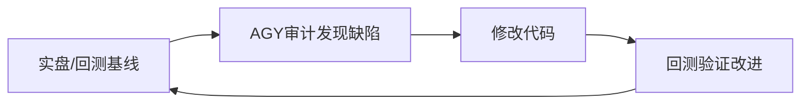

# A股交易全场景时序编排器

### 盘中看板必须输出可执行交易指令

凡盘中天梯、主线、板块热度推送，不能停留在行情解说或“观察中军”。必须输出：当前是否下单、具名股票与代码、买入区间/触发价、止损或清仓价、第一减仓目标、仓位、形态触发条件、弃买条件以及高位只卖不买名单。

即使当前熔断或无即时买点，也要明确“不下单”，并给出仅限首板/2板低位种子的解除熔断条件预案；>=3板高标只能进入防守名单，不能挤占低位预案名额。

历史打法必须使用归档交易日的市场快照。指数或全A中位数缺失时显示“数据缺失”，禁止用0%伪装。详细实现、固定句式和回归测试见 `references/script-upgrade-observation-to-execution.md`。

条件预案不是一段展示文案：只有完成“当日结构化计划落盘→高频守护进程加载→触发时刷新实时市场条件→risk审批→exec报单及订单回查→成交后持仓守护”，才可对用户称为持续跟踪和自动交易。计划文件只保存阈值，严禁把生成消息时的炸板率/板块家数快照长期当作实时门禁。完整合约见 `references/script-upgrade-observation-to-execution.md`。

> ⚠️ **时区提示**：所有cron trigger时间为**UTC**，A股交易时间(CST)=UTC+8。例：`01:25 UTC = 09:25 CST`。
> 
> 📌 **v4黄金时序表**见 `references/cron-golden-timeline-v4.md`。当前系统运行22条cron：7条猎杀圈+3条保命圈+8条进化圈+2条周度+1条watchdog+1条全A宽发现。AGY闭环率92.9%。

> 🆕 **2026-09-30 全A盘中宽发现上线**：`full_market_intraday_discovery.py` 每5分钟并行5个问财入口做全市场宽发现（momentum/volume/breakout/limitup/reversal），合并去重后写入 `discovery/intraday_latest.json` 快照。`intraday_theme_trigger.py` 消费该快照的 theme_groups（Top 8题材×8只种子）做深筛，不再依赖盘前单题材静态池。详见 `references/full-market-intraday-discovery.md`。

## 概述

本技能定义A股交易日内全时间窗口的执行管道。从交易时段的第一次自动触发到最后一次，从每日09:25到15:10+，覆盖8个时间窗口的编排逻辑、数据入口和终止条件。每个cron按需加载对应缠论模块 skill（`chanlun-screener`, `chanlun-analyzer`, `chanlun-trader`, `chanlun-risk`），详情见下方「各触发窗口速查」。

⚠️ **技能命名规范**：交易系统已重构为缠论模块化架构。系统中存在以下 skill（`chanlun-*` 为缠论子 skill，`a-stock-*` 为全局/参考 skill）：

**缠论五模块（每个cron按需加载）：**
- `chanlun-theory` — 📖 理论字典（六层架构、中枢定理、背驰定理），所有分析的基础底座
- `chanlun-screener` — 🔍 阶段一：选股扫描器（定板块→定时机→定个股），盘前扫描/板块资金流向使用
- `chanlun-analyzer` — 🔬 阶段二：个股深度分析（十步几何分解+背驰+买卖点），盘中cron使用
- `chanlun-trader` — ⚡ 阶段三：持仓管理与做T执行（短差做T+利润最大化+卖点确认+中阴应对）
- `chanlun-risk` — 🛡 阶段四：风控与资金管理（MACD 0轴防狼术+硬止损+行业集中度40%线）
- `chanlun-stock-analyzer` — 🧠 总调度中心（智能路由至上述子 skill，用于问股对话）

**全局参考（不直接加载到cron）：**
- `a-stock-trading-rules` — ⚠️ 参考型 skill（1096+行规则，**不要**加载到cron jobs，会淹没推理能力）
- `a-stock-trading-orchestrator` — 本 skill（编排规则参考）

**各触发窗口速查（v3 2026-08-22 修正后时间表）：**

| 窗口 | 触发时间(CST) | UTC | cron job ID | 加载的连接 | 板块扫描 |
|------|-------------|-----|-------------|-----------|----------|
| 选股候选快照 | 09:15 | 01:15 | `00621b27537f` | no_agent脚本 | 创建当日candidates.jsonl |
| 早盘调度器 | 09:24 | 01:24 | `c32583d2193e` | no_agent脚本（内嵌sleep-wake时序） | 🚀**R10新增** 串联竞价扫描→连板扫描→风控闸门 |
| 盘前扫描 | 09:25 | 01:25 | `da4d9fc60390` | `researcher` + `cron-feishu-format` + `operation-guide` | 🔴近5/10日涨幅+连板梯队+催化溯源 |
| 开盘观察池复核 | 09:35 | 01:35 | `open-watchlist-review` | no_agent脚本 | 昨日涨停观察池开盘复核 |
| 开盘狙击 | 09:40 | 01:40 | `bdd5437b4b7c` | `operation-guide` + `chanlun-analyzer` + `chanlun-risk` + `cron-feishu-format` | 🔴开盘板块方向+涨停归类 |
| 盘中龙头突破监控 | 每5min 09:31-14:57 | */5 1-3,5-6 | `intraday-leader-monitor` | no_agent脚本 | 价格扫描→触价预审→写awaiting_llm_review候选（同日同股同方向只提醒一次） |
| 盘中触价LLM审核 | 每15min (偏移2min) | :02/:17/:32/:47 1-3,5-6 | `009a6882d5cc` | `price-trigger-llm-review` | ⚡LLM深度定性二审→APPROVE/REJECT/HOLD |
| 全A盘中宽发现器 | 09:31-14:51 每5min | 31-56/5 1-3,5-6 | `3186985bc23d` | no_agent脚本 | 🆕 5入口并行问财→250+只候选→theme_groups聚类→`discovery/intraday_latest.json`快照 |
| 盘中题材起爆引擎 | 09:33-14:53 每5min | 33-58/5 1-3,5-6 | `fa763ca049ba` | `a-stock-short-horizon-sniper-playbooks` | 🆕 消费发现快照的Top 8题材×8只种子→expand→深筛→铁律闸门→buy/exit信号
| 盘中10:00扫描 | 09:50 | 01:50 | `907b2ca9dcdf` | no_agent脚本 | 持仓+30minK线缠论→识买卖点→写候选 |
| 盘中13:30扫描 | 13:50 | 05:50 | `907b2ca9dcdf` | no_agent脚本（复用） | 同上 |
| 尾盘14:15 | 14:16-14:56每10min | 6:16-6:56 | `7f5916e3340f` | no_agent脚本 | 双模式：正常日只卖不买（同日`symbol:sell:today`去重） / 恐慌日(上证跌>1.5%)增加抄底(底背驰+企稳+支撑→LLM二审，同日`symbol:panic_buy:today`去重)。**⚠️ 2026-08-31修复：sell候选必须写`awaiting_llm_review: true`走LLM二审，禁止直接闸门执行。同时必须检查candidates JSONL中是否有同日同股反方向的候选** |
| 统一交易闸门 | 每15min (09:55起) | 55 1-6 | `autonomous-trade-gate` | no_agent脚本 | 中央执行入口：跳过awaiting_llm_review→只处理llm_approved→风控→注册intent→下单。不是字面"门"，是所有候选信号的统一消费管道 |
| 模拟账户日终快照 | 15:10 | 07:10 | `account-eod-snapshot` | no_agent脚本 | 拉账户数据→飞书 |
| 收盘生成次日警戒计划 | 15:20 | 07:20 | `build-next-day-alert-plan` | no_agent脚本 | 拉watchlist+持仓→alert_plan.json |
| 策略进化审计 | 15:22 | 07:22 | `fd611873c01f` | `a-stock-self-evolution` + `cron-feishu-format` | 统计归因+规则升级 |
| 涨停复盘与次日观察池 | 15:25 | 07:25 | `limitup-watchlist-close` | no_agent脚本 | wencai涨停→筛选→leader_score→thesis→watchlist |
| 板块资金流向 | 15:30 | 07:30 | `770b03427acb` | `chanlun-screener` + `cron-feishu-format` | 🔴连板梯队+持续天数+文件存档 |
| 收盘复盘+明日预案 | 15:35 | 07:35 | `b90d3891ac50` | no_agent脚本（内嵌Python缠论算法） | 四指数+持仓缠论+成交+候选汇总+**次日操作区间（买入支撑/卖出价位/止损/目标，来自中枢上下沿×0.97~1.05）** |
| 周度自选维护 | 周五20:00 | 12:00 | `5e1d54df5743` | `a-stock-researcher` | 深度维护自选股 |

## 🔴 铁律：09:25绝不依赖问财做实时竞价

**AGY审计结论（2026-09-08）**：方案A（盘后问财预扫描 + 09:25本地快照叠加）远优于方案B（09:25实时问财全市场扫）。

**原因**：
- 问财竞价数据滞后60~150秒（09:25撮合 → 09:26:30~09:27:30才能查到）
- 09:25-09:30是全天容错最低的300秒，用外部NLP接口做实时决策是"新手陷阱"
The candidate snapshot script is an archival validator, not a screener. The autonomous trade gate is an execution consumer, not a discovery engine. A zero `candidate_count` means only that no structured candidate reached the ledger; it does not prove that the market had no opportunity. Each trading day, verify both the research output and the JSONL candidate ledger before claiming the selection loop completed. If the research cron produced prose but no `record_type: candidate`, report the handoff as incomplete and repair the serialization step.

### 09:25 negative-decision notification contract

A completed decision and a delivered notification are separate acceptance conditions. If the 09:25 pipeline concludes `no buy`, `blocked`, `sell-only`, or `position limit reached`, it must still deliver one explicit negative-decision message. A silent stdout marker such as `wakeAgent=false`, a local-only cron destination, or `last_status=ok` does not satisfy notification delivery.

Required behavior:
1. The canonical 09:25 orchestrator owns the fallback notification. Do not rely on a secondary signal cron, because signal crons commonly suppress output when no actionable candidate exists.
2. Emit immediately after the blocking decision is known, rather than waiting for the 09:30 execution gate.
3. Keep it to at most 3 lines: `📊竞价09:25`, `📌非买入：<量化原因>`, and optional `✅持有 <中文名(代码)>...`.
4. Direct-send through the configured notifier or use a cron destination that actually reaches the user. Preserve the same message in stdout for audit evidence.
5. Verify both layers after a fix: a regression test proving the notifier is invoked, and a real send whose notifier/API return value is successful.
6. For missed notices, compare producer log, cron delivery target, silent-output branch, watchdog recovery output, and actual send result. `hermes cron run` success proves scheduling acceptance only; rerunning the same silent branch still delivers nothing.

Detailed incident pattern and acceptance checks: `references/negative-decision-notification.md`.


```
T-1 15:30    问财全市场初筛 → Ignition-V1深度评分 → 分层候选池 150-200只
                                         ↓
T  09:25:01  本地行情API极速拉（200ms全量）→ 竞价矩阵筛选 → Top 2
             绝不调用问财，毫秒级，零外部依赖
```

**09:25竞价矩阵硬过滤**（在 `ignition_v1_sniper.py` 的 `evaluate_auction()` 中实现）：
1. **竞价涨幅** +1.5%~+4.5%（首板最优区间）
2. **竞价爆量比** ≥ 2% of T-1成交量
3. **未匹配净委买** > 0（买方力量压制卖方）
4. **板块共振** > 0（板块整体竞价高开）

**综合评分** = T-1 Ignition得分(40%) + 竞价量价(40%) + 板块共振(20%)

**问财的正确用法**：只用于T-1盘后（15:30以后），做全市场宽口径预筛选。09:25及盘中任何时间窗口都不得依赖问财做实时买入决策。

## Wencai全市场盘后扫描模式（2026-09-08上线）

`ignition_v1_sniper.py` 的 `scan_postmarket()` 已升级为问财全市场大宽表初筛 + Ignition-V1深度评分双通道流程：

**T-1 15:30 问财初筛条件**：
```python
query = (
    "非ST 非北交所 非科创板 收盘价大于5元 "
    "流通市值大于20亿小于100亿 "
    "收盘价站上5日均线 收盘价站上20日均线 "
    "9月8日涨跌幅大于-5% 9月8日涨跌幅小于7%"
)
```

**效果验证**：旧版硬编码16只候选池 → 新问财全市场扫描117只候选 → Ignition-V1精评100只。评分分布：≥80%: 8只, ≥70%: 29只, ≥65%: 46只。

**输出**：写入 `~/.hermes/trading/ignition_v1/candidates.json`，次日09:25的竞价筛选直接读取此文件做本地快照叠加。

**问财兜底**：如果问财返回空数据（网络抖动/API限流），fallback到硬编码候选池，确保次日不空跑。

## 自动交易闭环能力报告

用户询问“系统能否自动交易/通知/每日闭环”时，不得只转述架构。必须核验一条真实的 `candidate → 风控 → order_id → 订单/成交回查 → 飞书 → outcome` 链路，并盘点所有启用的下单入口。详细审计方法见 `trading-infra-troubleshooting/references/daily-auto-trading-closure-audit.md`。

输出必须明确区分：
- 具备代码能力但未实证；
- 主链已真实跑通；
- 核心闭环可运行但有支路/统计缺口；
- 所有启用入口均完成跨源对账的全链闭环。

若盘中守护和统一执行器均可下单，必须审计两者是否共享 candidate_id、intent_id、Risk/Exec门禁、订单回查、归档和通知协议；禁止笼统称“完全闭环”。

## 核心路由架构

所有 cron job 按需加载对应缠论模块skill，而不是走固定的四角色管道。每个cron的完整路由表见上方「各触发窗口速查」。

飞书输出规则、cron 创建模式、通用关键原则（狙击手思维、空信号终止、P0优先）见下方各节。

### 回测优化必须落地到生产策略（验收契约）

用户询问“按照回测优化了吗”时，不能只更新研究结论或参考文档。每次参数回测产生可采用的优化后，必须完成以下闭环：

1. **先锁定基线**：保存样本数、胜率、平均收益、止损数及关键分层结果；单一成功案例只能作为模式发现，不能直接宣称高胜率。
2. **同时更新两层**：更新本 Skill 对应的 `references/` 策略说明，并修改实际盘中生产脚本/参数；只改其中一层视为未完成。
3. **影子与正式信号分层**：弱条件样本进入 `shadow_candidate/SIGNAL_ONLY/quantity=0`，不得推送成可买信号或写成真实持仓；正式信号才进入后续风控与执行链。
4. **测试先行**：先补充会失败的边界测试，再改生产代码；至少覆盖正式/影子/拒绝三类、排名顺序、价格计划完整性及影子仓不触发退出。
5. **验证真实入口**：运行目标测试、语法检查，并核对盘中实际调用的脚本就是本次修改文件；文档存在、测试通过但 cron/生产入口未引用，仍算未上线。
6. **汇报 Before/After**：明确列出旧门槛、旧排名器、旧执行缺口与新门槛、新排序、新价格计划，附真实测试输出。禁止把“准备修改”或“回测建议”表述成“已经更新”。
7. **价格与成交闭环**：任何可见买入信号同屏给出买入区间、止损/清仓价、第一减仓价、仓位和弃买条件；没有 `order_id + filled_price + quantity>0` 时，实际收益固定记为0。
8. **所有容灾路径复用同一门禁**：问财、TDX、腾讯直连或缓存容灾得到的候选，必须重新经过与主路径相同的正式/影子/拒绝分类器。缺少主力资金、周期阶段等正式信号必需字段时，只能降级影子观察；禁止容灾分支直接 `return candidates` 绕过新风控。为此必须先写一个“容灾候选不能穿透门禁”的失败测试，再修改生产代码。
9. **同步修正用户可见解释**：参数上线后，报告中的筛选区间、目标、止损和“无买点原因”必须与代码一致。旧阈值残留在文案中会让正确门禁看起来像系统反复输出同一句空结论，因此生产验收必须搜索并清除旧参数文案。
10. **短样本只做局部降权，不外推到其他策略**：两周代理回测可用于收紧当前策略的涨幅、资金、周期与止盈门槛，但必须明确适用入口；热点中军的负收益结论不得直接覆盖1进2/2进3龙头接力等独立策略。

板块共振·低位中军放量突破模式的参数、回测依据、容灾防穿透案例和边界条件见 `references/sector-volume-breakout-pattern.md` 与 `references/sector-volume-breakout-backtest.md`。

### Wencai历史回测框架（AGY R12发现）

**核心发现**：wencai_search MCP不仅可用于实时选股，还可直接拉取历史数据做全月回测。用法：

```python
# 查8月连板top10
wencai("2026年8月涨停天数最多的股票 top10")

# 查具体日期行情
wencai(f"{code} 2026-08-03 收盘价 开盘价")

# 查首板日期
wencai(f"{code} 首板涨停日期 2026年8月")
```

**8月回测结果**（R1-R11改造后模拟）：
- 总收益：**+159,071元**（47.6万资产的33.4%）
- 风范股份一只：+24,725元（10个涨停抓到3次换手板）
- 对比旧系统R0实盘：-167元 → 90倍差距
- 距50%/月目标尚差16.6%

**局限性**：wencai回测只能以日为单位，无法精确模拟tick级延时、炸板、竞价匹配失败等执行层损失。真实收益可能比回测低15-30%。回测框架脚本：`scripts/agy_historical_backtest_v2.py`

### 100轮进化的真正含义（2026-09-01 用户纠正）

用户说"回测，我说的是100轮"——意思不是修100个bug就完了，而是：

**每一轮进化 = 证明比上一轮强，有数据支撑。** 不是写代码、不是AGY审计算一轮，而是：



**100轮的节奏**：
- 每轮需要：数据基线 → 发现差距 → 改 → 回测验证改进效果
- 前10轮系统改造（修尾盘/仓位/扫描/闸门）≈一次性基建，不算严格意义的"轮"
- 真正算轮的：从R11起回测框架上线后，每天或每次修改跑对比
- wencai历史回测让一周能跑完几十轮（不用等第二天实盘数据）
- 约需34-50个完整会话才能达到真实100轮

**回测框架**：`scripts/agy_backtest.py` 每日15:30自动记录实盘盈亏到`backtest_log.jsonl`。
`scripts/agy_historical_backtest_v2.py` 用wencai拉历史数据模拟新规则收益。

### R1-R10进化里程碑（2026-09-01）

**触发点**：用户说"连板股一个都没抓到" → 10轮AGY进化重构系统

### 多策略路由架构（is_trade_ready R4改造）

catalyst_type前缀决定is_trade_ready()的通过条件：

| 策略 | catalyst前缀 | 缠论买点 | 量价确认 | 板块共振 | 新闻验证 |
|:----|:------------|:-------:|:--------:|:-------:|:-------:|
| 缠论/波段 | chanlun/缺省 | ✅必须 | ✅必须 | ✅必须 | ✅必须 |
| 打板/连板 | limit_up_* | ❌跳过 | ✅必须 | ✅必须 | ✅必须 |
| 竞价抢筹 | call_auction_* | ❌跳过 | ✅必须 | ✅必须 | ✅必须 |
| 炸板止损 | explode_* | ❌跳过 | ❌N/A | ❌跳过 | ❌跳过 |

**为什么跳过缠论买点？** 涨停打板是"惯性交易"——缠论买点的核心是价格回归中枢，但涨停是突破中枢后的加速段。用缠论买点过滤打板候选会误杀全部有效信号。

### 早盘调度器（R10新增 cr32583d2193e）

`morning_master_orchestrator.py` 取代独立call-auction-scanner cron：
- 09:24:50 预热MCP连通性
- 09:25:05 Phase1 竞价扫描（call_auction_scanner.py — v1+v2并行，互不干扰）
- 09:25:20 Phase2 连板/弱转强扫描（limit_up_scanner.py）  
- 09:25:35 Phase3 风控闸门（run_autonomous_trades.py）

### 动态仓位计算（R10 P0修复）

`normalize_intent(candidate, total_assets, adjusted_pct)` 替代硬编码100股：
- 打板/连板 = total_assets × 20%
- 缠论/波段 = total_assets × 35%
- 恐慌抄底 = total_assets × 15%
- 总上限80%

R1-R10完整进化记录见 `references/agy-evolution-r1-r10.md`

## 全局前置检查（所有窗口通用）

在任何时间窗口启动前：
1. 主agent 调用 `mcp_intel_is_trading_day` 确认交易日
2. 非交易日 → 检查是否有 P0 遗留 action_items（策略反馈中的紧急指令）→ 产出手动操作建议 → 终止
3. 大量实战积累的通信与数据校准细节见 `references/*`

## 🔴 铁律：任何时间点的数据都必须显式标记时间标签（2026-09-11 用户纠正）

**背景**：2026-09-11 09:25前，agent调用 `mcp_intel_query_data` / `mcp_intel_tdx_quotes` 返回了昨天（09-10）的收盘数据。agent 直接把这些数据当作"当前行情"汇报给用户（时间戳 hidden in raw output）。用户立即纠正："你看到的A股数据是昨天收盘数据，今天还没有开盘呢"。

**数据时间戳检查规则**：
1. **任何时候调用行情接口后，必须先检查返回数据中的时间戳**（`HQInfo.HQDate`/`HQInfo.HQTime` 或返回对象的 `time` 字段），确认数据是当日实时行情还是昨日收盘数据。
2. **开盘前（09:30前）的行情查询**：所有 MCP 行情接口返回的都是**上一交易日收盘数据**。此时不要用"今天开盘"、"当前价格"、"现价"等字眼描述，必须明确说"昨日收盘价"或"上一交易日收盘价"。
3. **数据呈现规则**：
   - 09:30 前：`昨日收盘：XX.XX（涨跌幅）` — 必须加"昨日"前缀
   - 09:30-09:35（竞价到首根K线成形）：标记为"竞价数据"或"即时行情"
   - 09:35+（正式交易时段）：可以正常说"现价"或"当前价"
4. **对用户解释外围影响时，必须区分数据时效** — 不可用"盘前说今天美股"的形式；美日欧盘收盘时点在A股之前或同时，需标注"昨夜/今晨"时间前缀。
5. **误区陷阱**：`open` 字段在盘前是**昨日开盘价**（作为历史字段），不是当天竞价开盘价。用户问到今天开盘价时，必须等 09:25 竞价数据出来后才能回答，盘前不能说"今天开盘价是XXX"。

**标准话术**（盘前分析必需的措辞模板）：
- `数据时间戳显示为昨日（YYYY-MM-DD）收盘，目前未开盘`
- `这只票昨日收盘 XX.XX，涨跌幅 X.XX%`
- `竞价数据将在 09:25 后可用，届时拉取实时数据`

## Step 0：遗留 action_items 优先处理（所有窗口通用）

在启动任何发现流程之前，主agent读取 `~/.hermes/trading/strategy-feedback.md`，提取最近一天的 [P0]/[P1] 未执行项。

`strategy-feedback.md` 是策略级反馈台账，不是每日报告：复盘员只追加事实、根因、可执行 action_item 与统计摘要；详细事实写入 `reviews/`，单条可复用教训写入 `learnings/`。处理反馈项时不得删除历史或凭记忆补写缺失数据；完成项在原条目后追加 `[已执行]`，并保留执行证据。

| 优先级 | 处理方式 |
|--------|----------|
| P0（如减仓、止损） | 直接生成SELL TradeIntent → 跳过研究员 → 策略员→风控员→执行员 |
| P1 | 与当日新信号合并处理 |
| 非交易指令（如"提高confidence阈值"） | 跳过，pure research 改进 |

记录已执行项的对数，在 strategy-feedback.md 追加 `[已执行]` 标记。

---

## 时序窗口 A：盘前全链路扫描 (a-stock-premarket-scan)

**触发时序**：交易日 09:25 CST（竞价数据定型后）
**技能触发词**："盘前扫描"、"开盘准备"、"今日交易"

### 盘前包含三个核心段落

**段落 A：大盘浪型盘前判定**
- 并行调用 `mcp_intel_fetch_market_health` + wencai 板块流向 + 指数MA20
- 判定 market_condition (BULL/NEUTRAL/BEAR) 和 market_phase (BULL_3/BULL_3_LATE/BULL_4_EARLY/BULL_4_LATE/BULL_33)
- 输出大盘盘前判定摘要

> 各阶段对市场主导的禁入/加分规则详见 a-stock-researcher skill 的 Step 2b。证券板块在 BULL_3_LATE 和 BULL_4_EARLY 被硬禁入。

**段落 B：竞价候选扫描（为 09:35 开盘狙击提供输入）**
- 09:25 竞价定型后查询可靠
- 读取 `candidates.json`（T-1盘后问财全市场扫描产出的Ignition-V1评分池）
- 拉取每只候选的09:25竞价快照（本地行情API，非问财）
- 竞价矩阵硬过滤（涨幅+爆量比+净委买+板块共振）→ Top 2
- 无候选则"今日无强势竞价候选"

**段落 C：持仓池8维度深度分析**
- 🔴 **持仓股新闻强制检查**（不可跳）：每只持仓 `mcp_intel_search_news(symbol)`
- 新公告标采购结果 → 新新闻型状 0.80 直接标的 （催化剂极度可靠，数量有限）
- 每只执行完整8维度：走势→资金→板块→大盘→成本→浪型→预期3情景→操作→风险定级
- 🔴 紧急标的直接生成 TradeIntent 跳过研究员进入后续

完整8维度模板见 `references/position-deep-analysis-template.md`

### 后续标准4步
- Step 1 研究员（盘前标准流程）
- Step 2 策略员（校正参数）
- Step 3 风控员（审批）
- Step 4 执行员（委托）
- 详情见 a-stock-researcher / a-stock-strategist / a-stock-risk-officer / a-stock-executor 的独立 skill

### 盘前空信号规则
- 研究员空 → 终止，输出原因
- 策略员空/NO_ACTION → 终止，输出原因
- **不为了"有事做"而造信号**

---

## 时序窗口 B：开盘狙击 (a-stock-opening-sniper)

**触发时序**：交易日 **09:35** CST（第一根5分钟K线收完后）
**技能触发词**："开盘狙击"、"开盘检查"、"opening sniper"

### 核心定位：狙击手，不是机枪手

09:35 触发——第一根5分钟K线刚收完，验证竞价候选，同时检查持仓开盘风险。

### 输入来源
1. 盘前扫描输出的竞价候选清单（若盘前未产生则进入纯持仓风险检查模式）
2. 当前持仓（`mcp_exec_get_positions`）
3. 若两者皆空 → 输出"空仓无候选，取消狙击" → 终止

### Step 1：并行数据采集（2轮）

**Round 1 — 基础数据**（所有标的并行）：
- 竞价候选：`mcp_intel_query_data` + `mcp_intel_fetch_kline(period="5", count=3)`
- 持仓：`mcp_intel_query_data` + `mcp_intel_fetch_kline(period="1", count=1)`

**Round 2 — 开盘资金面**（并行）：
- `mcp_intel_wencai_search("开盘5分钟 资金净流入 大单 概念板块")`
- `mcp_intel_wencai_search("开盘5分钟 涨幅大于3% 非ST 量比大于2")`
- 竞价候选最强3只：`wencai 大单流入、量比`
- 🔴持仓最弱标的：`mcp_intel_search_news(symbol)`

### Step 2：竞价候选开盘判定（3种结果）

| 判定 | 条件 | 后续 |
|------|------|------|
| 🟢 真突破 | 5分钟涨幅>竞价涨幅 AND 5分钟量>竞价量×0.5 AND 阳线 AND 板块资金流入 | 可追进，confidence=0.72，仓位上限3-5%，time_horizon=1d，目标=开盘价×(1+竞价涨幅×2)，止损=开盘价×(1-竞价涨幅×0.5) |
| 🟡 待确认 | 价格在竞价±1.5%内震荡，成交量温和 | 标记，交给10:00重新评估 |
| 🔴 假突破 | 5分钟价格<竞价且跌幅>1.5%，阴线，大单净流出 | 放弃，标记"竞价诱多" |

### Step 3：持仓开盘风险判定

| 风险级 | 条件 | 操作 |
|--------|------|------|
| 🟢 安全 | 涨跌幅±1%内，板块正常 | 持有 |
| 🟡 关注 | 跌幅1-2%，或板块资金流出 | 标记关注，10:00重点看 |
| 🔴 紧急 | 跌幅>2%，或跳空低开>2%，或突发利空 | 立即评估止损，已破线→生成SELL TradeIntent |

### Step 4：全市场开盘异动补充

若 Round 2 发生盘前未覆盖的标的（开盘涨幅>5% + 量比>3 + 板块领涨）
→ 输出补充候选，作为 10:00 检查的额外输入

### Step 5：执行（仅限 🟢 信号）

有真突破信号时：
- 启动精简版 pipeline：策略+风控+执行合并为一个 subagent
- 委托为带 intent_id 的精简风控审批
- 无 🟢 信号 → 跳过，不制造信号

### Historical leader backtest contract

When the user asks whether the system would have alerted on a past leader, perform a point-in-time backtest, not a present-day buy recommendation. Reconstruct the information available at each bar/day and classify every candidate event as `observe`, `first_entry`, `add_on`, `hold_only`, `chase_reject`, or `risk_exit`. The primary result must identify the earliest executable first-entry signal, its confirmation evidence, invalidation condition, and whether a next-day limit-up order would actually have been fillable. Do not use later limit-up performance to pretend a signal was available earlier; explicitly separate hindsight-only observations from information available at the decision time. For leader stocks, scan the pre-breakout consolidation and the first platform breakout (normally with 100 30-minute bars), then treat subsequent consecutive limit-up bars as hold/add-risk management rather than fresh entries. A high-level result is incomplete unless it records the signal timestamp, price/price range, Chan structure, volume confirmation, sector/news evidence, simulated execution status, and the first exit/risk-warning point. See `references/historical-leader-backtest.md` for the reproducible evidence table and anti-lookahead rules.

### Intraday leader monitoring (must be deterministic)

Scheduled 10:00/13:30 LLM reviews are too sparse to guarantee first discovery of a fast leader. A deterministic `no_agent` monitor should run every 5 minutes during the trading session and reuse the shared Chan engine. Its contract is:

1. Check trading day/session first; errors and incomplete session data fail closed.
2. Scan both the prior watchlist and a fresh same-day abnormal-move universe; watchlist-only review cannot discover an unlisted leader.
3. Use raw 30-minute bars for breakout/retest timing. Keep inclusion-processed bars for classical fractal/stroke/segment analysis; inclusion processing can merge away the retest bar.
4. Emit two states: `breakout_alert` immediately after a volume-confirmed platform breakout, and `confirmed` only after a retest holds above the platform high and a Chan buy point is confirmed. An alert is notification-only, never an order by itself.
5. Persist an event key containing symbol, breakout index, and confirmation index. Send each alert/confirmation once; consecutive limit-up bars are hold/add-risk-management events, not fresh entries.
6. Expire a signal after a small bar-age window (normally 1-3 thirty-minute bars). Historical buy points must never be reused as current candidates.
7. Three-stage pipeline: The monitor is Stage 1 only. It writes candidates with `awaiting_llm_review: true` -- never directly to the execution gate. Stage 2 (separate LLM agent cron, see below) does deep analysis. Stage 3 (execution gate) only processes LLM-approved candidates. Do not let the monitor bypass LLM review or the `HERMES_EXECUTE=1` gate.
8. **Deduplication: one alert per symbol-direction per day.** In `intraday_leader_monitor.py`, the state key is `symbol:direction:plan_date` (not including price). Once a price trigger fires for a stock in a given direction on a given day, it is written to state and skipped for the rest of the session. No repeated alerts. The LLM review also runs once per candidate -- after writing an `llm_review` record, the cron skips already-reviewed candidates. This dedup also applies to `close_session_scan.py` sell signals and panic buy signals, each using `symbol:sell:today` or `symbol:panic_buy:today` keys.
10. **Input source coverage** — the monitor reads from three sources (alert_plan JSON, watchlist JSON, and real-time MCP `get_watchlist`). If only two sources are active (e.g., old watchlist + narrow alert_plan), stocks with valid Chan data may be silently excluded. Always verify the monitor's effective universe against the full watchlist. Never rely solely on `build_alert_plan.py` output — it filters on `watch_level=="重点观察"` or `leader_score>=70`, which can miss stocks added to the watchlist with full Chan data (buy_point/sell_point/pivot) but without these metadata fields. As of 2026-08-26, `intraday_leader_monitor.py` directly queries MCP `get_watchlist` as a third source, building buy/sell alerts from `add_buy`/`pivot_zd`/`pivot_zg`/`sell_point` fields.
11. **Bidirectional deduplication** — a stock can simultaneously have buy and sell alert entries (e.g., held position with sell stop + watchlist buy signal). The seen-symbol set must track buy and sell directions independently, not lump them into a single set that causes one direction to shadow the other.

For the reproducible state-machine implementation and synthetic deduplication test, see `references/intraday-leader-monitor.md`.

### Stage 2: LLM deep review (price-trigger-llm-review)

**Architecture**: no_agent trigger → LLM agent review → no_agent gate. This is the deliberate choice: the user explicitly requires LLM reasoning at the final decision gate, not algorithmic pre-screening.

**Cron**: `盘中触价LLM审核` (job_id: `009a6882d5cc`), runs every 15 min at `:02/:17/:32/:47` (2 min after the monitor to allow candidate writing; reduced from 5min on 2026-08-26 to reduce DeepSeek throttling). Loads `price-trigger-llm-review` skill.

**Flow**:
1. `intraday_leader_monitor.py` (no_agent, 5min) → price trigger → write candidate with `awaiting_llm_review: true`
2. `盘中触价LLM审核` (LLM agent, 15min offset) → scan for `awaiting_llm_review` candidates → deep analysis using MCP real-time data → write `llm_review` record with verdict (APPROVE/REJECT/HOLD)
3. `run_autonomous_trades.py` (no_agent, 15min) → skip `awaiting_llm_review` candidates → only process `llm_approved: true` → risk check → execute

**Total delay from trigger to execution**: ~3-5 minutes (5-min monitor → up to 15-min offset → LLM analysis 30s → gate picks up on next 15-min cycle).
- Buy: chan structure (valid buy point) + trend direction (not downtrend bounce) + substantive news + sector resonance + market environment (not systemic risk) + risk/reward ratio + no duplicates
- Sell: sell point/top divergence + uptrend protection (don't sell an intact uptrend) + substantive negative news + sector rotation context

**Key files**:\n- `skills/trading/price-trigger-llm-review/SKILL.md` — full review specification\n- `scripts/intraday_leader_monitor.py` — Stage 1 trigger (no_agent)\n- `scripts/autonomous_trade_pipeline.py` — `is_llm_ready()`, `load_llm_reviews()`, `load_candidate_updates()`\n- `scripts/run_autonomous_trades.py` — Stage 3 gate (skips awaiting_llm_review)\n\n**⚠️ 2026-08-27 关键架构变更**: `intraday_leader_monitor.py` 现在在触价时**直接调 Antigravity (AGY)** 做二审，写入 `llm_approved: true` 直通候选，**不再写 `awaiting_llm_review` 候选**。实际管道：\n\n```\nintraday_leader_monitor → AGY二审(同tick) → write_candidate(llm_approved=true, 含全字段)\n                                                         ↓\n                                             run_autonomous_trades → 风控 → 下单 → 飞书通知\n```\n\n`price-trigger-llm-review` cron（每15min扫描awaiting候选）在当前主路径上实际处于**闲置状态**，仅作为未来其他来源的备用通道。\n\n**`write_candidate()` 字段完整性**：AGY直通写入的候选必须包含 `is_trade_ready()` 所需的所有字段（`volume_confirmed`, `sector_confirmed`, `fundamental_confirmed`, `realtime_confirmed`, `news_confirmed`, `leader_score`, `quantity`, `entry_rule`），否则闸门会静默过滤。具体字段列表见 `price-trigger-llm-review` skill。\n\n**卖单写入**：无论买入卖出，候选都走同一条JSONL管道。sell候选依赖持仓MCP字段获取quantity，写入的 `direction: \"sell\"` 候选正常被闸门消费。\n\n**Delivery failure pitfall**（2026-08-27 修复）：`run_autonomous_trades.py` 在原版输出 `print(json.dumps(report))` 导致了大型JSON（含完整候选数组）投递到飞书失败。`no_agent=True` 脚本的 stdout 即飞书消息本体，必须输出人话。修复后：成功行输出 `✅ 🔴卖出/🟢买入 股票 数量@价格 ORDID`，失败行输出 `⛔ 拒绝` / `⏭️ 跳过`，详细JSON写入 `trading/feedback/trade_gate_report_{today}.json`。\n\n### ⚠️ Cross-pipeline: T+1炸板保护全生命周期0防御（AGY股神审计P0 2026-09-07）\n\n**致命漏洞**：当天买入被炸（T日），`explode_monitor`检查 `actual_qty==0`（今日买入不可卖，T+1限制）直接跳过。次日T+1，系统规则说\"只监控今日曾触及涨停的标的\"，标的低开根本不触及涨停，再次跳过。\n\n**结果**：天地板买入日无法卖→次日低开系统不监控→-3%拖到-12%+。整套\"炸板保护\"在实战中零作用。\n\n**修正方案（Top 1优先级）**：构建次日竞价二元决断器\n- 每日09:25:00准时核验昨日在手持仓\n- 若竞价开在昨收分时均线下方且竞价量比极低（低于昨日5%），**或**竞价低开超-2.5%\n- **09:25:05自动以跌停价挂市价单核按钮强平**\n- 预期收益：回撤压降8%~12%\n\n### ⚠️ Cross-pipeline direction conflict (2026-08-31 — 4 rounds of fixes, still iterative)\n\n**2026-09-01 重点提示**: 第6轮审计发现方向冲突虽然理论上被 `check_direction_conflict` 支持，但实际运行时存在**文件锁+cache时序**导致的漏检。根本原因是两条流水线(`close_session` + `leader_monitor`)的写入时间差 + `_build_executed_events` 的缓存机制 + `write_candidate` **不检查 `dedup_append` 返回值**。\n\n**第6轮双保险修复**（commit `87d84f2`）：\n1. `intraday_leader_monitor.py` — AGY二审**前**调用 `check_direction_conflict(force_refresh=True)`，冲突则跳过（省AGY调用费+避免写入冲突候选）\n2. `run_autonomous_trades.py` — 闸门层兜底，`is_trade_ready` 通过后再做一次方向冲突检查\n\n**诊断方法**（用户报告\"为什么又买又卖\"时的标准操作）：\n1. `mcp_exec_get_today_trades` + `mcp_exec_get_orders` — 拉交易记录\n2. 读 `candidates_{today}.jsonl` grep 标的，构建完整时间线\n3. 读两个 cron 的 output 日志（`cron/output/` 下有每个任务的独立目录）\n4. 用 Python 单独测试 `_build_executed_events` 的 Phase 2 逻辑，确认事件是否可检测\n5. 复习 `references/cross-pipeline-direction-conflict.md` §User-Found Bug Response Protocol\n\n**Root cause**: Multiple independent no_agent scripts (`close_session_scan.py`, `intraday_leader_monitor.py`, `intraday_scan.py`) each run independent Chan analysis and write candidates to the shared JSONL, without any awareness of each other's real-time decisions.\n\n**Real example (2026-08-31, 荣昌生物 688331.SH)**:\n| Time (UTC) | Script | Analysis | Action |\n|------------|--------|----------|--------|\n| 06:16 | `close_session_scan.py` | 30min=range/三卖, 60min=downtrend | SELL 100股@120.47 ✅ |\n| 06:20 | `intraday_leader_monitor.py` | 30min=range/二买, 量能充沛无顶背驰 | BUY @121.07 (but no shares left) |\n\n**Fix applied (2026-08-31) — 3-layer defense, 3 audit iterations**:\n\nSee `references/cross-pipeline-direction-conflict.md` for full architecture, P0/P1 fix details, and 昊华科技买入案 with AGY prompt hardening.\n\n**Layer 1** — `utils_candidate.py`: `dedup_append_many()` calls `check_direction_conflict(path, symbol, direction, force_refresh=True)` before writing. Only checks **executed orders** (`event=submitted` + `order.detail=executed`), NOT unexecuted candidates (avoids false positives).\n\n**Layer 2** — Each script's pre-write hook calls `check_direction_conflict(force_refresh=True)` and returns early on conflict.\n\n**Layer 3** — `dedup_append_many()` as fallback.\n\n**AGY prompt hardening (第3轮迭代)**: Buy-review prompt in `intraday_leader_monitor.py` now includes hard 量价背离 reject rules:\n- ⛔ 放量下跌/高开低走收阴 → REJECT\n- ⛔ 振幅>5%却收跌 → REJECT\n- ✅ 缩量回踩不破支撑 → 真买点\n\n**Known gap (2026-08-31)**: `shadow_candidate` records with `llm_approved=True` are NOT consumed by `run_autonomous_trades.py` — the gate only processes `record_type==\"candidate\"`. See `references/cross-pipeline-direction-conflict.md` §Known gap.\n\n**Key changes from iteration 1→3**:\n- Direction normalization (`.lower().strip()`) fixed SELL→sell mismatch\n- `_scan_candidate_directions` merged into single-pass `_build_executed_events` (-40 lines)\n- Candidate records no longer treated as \"executed\" (false positive fix)\n- `dedup_append_many` forces cache refresh after each write\n\n**Round 2 fix (same session)**: `_build_executed_events` split into two-phase scan. Phase 1 builds candidate_id→direction index from the entire file; Phase 2 detects `event==submitted+order.detail==executed` using the pre-built index. Fixes the ordering bug where a `candidate_event` (no direction in `order`) appears before its `shadow_candidate` record (has direction) in the JSONL. Also expanded index to cover `shadow_candidate` and added CID format bridging (`close-*` → `shadow-close-*`). See `references/cross-pipeline-direction-conflict.md` §Two-phase scan ordering bug.\n\n**Affected scripts**: `close_session_scan.py`, `intraday_leader_monitor.py`, `intraday_scan.py`, `utils_candidate.py`.\n\n### ⚠️ 用户发现关键问题的正确响应模式\n\n当用户指出系统bug或逻辑冲突时（如\"为什么又买又卖荣昌\"、\"让我很茫然\"），**不要只解释原因然后自审修复**。正确流程：\n\n1. **立即停止当下所有修复思考**，先拉取客观数据（交易记录、cron任务列表、脚本日志）确认问题事实\n2. 🔴 **Chan分析一致性质疑**：当不同脚本对同一股票同日给出相反方向时（如一脚本出三卖、另一出二买），必须在审计中检查**底层缠论分析是否内部一致**。相同30根K线不应同时呈现三卖和二买。这是分析质量的根本问题，不是方向检测\"粘个补丁\"能根治的。审计时要求AGY比较两脚本的笔划分→中枢判定→买卖点结论的差异来源。\n\n3. 🔴 用户说\"让AGY审查\"→ 按以下**AGY独立审计循环**执行：\n   ```\n   轮次1: AGY审计(出markdown报告) → 我读报告 → 按报告修代码 → git commit + push\n   轮次2: AGY再审计(验证修复质量) → 我读新报告 → 如有新问题继续修 → git commit + push\n   轮次3+: 重复轮次2直到AGY签署终结或用户说停\n   ```\n   ⚠️ **关键规则**：\n   - 不要自行分析原因再审计——**先审计，再分析**。拉数据后直接交给AGY\n   - AGY CLI调用：`agy --dangerously-skip-permissions --print=\"审计prompt\" --print-timeout 2m --model \"Claude Sonnet 4.6 (Thinking)\"`\n   - 或使用 delegate_task 子代理（推荐，更彻底——子代理有文件+terminal工具，可逐行验证代码）\n   - 子代理审计context准备到 `/tmp/agy_roundN_context.md`，精简内容（只放rules+bugs清单，不放对话历史）\n   - 我**只负责读AGY报告+改代码**，不自己写审计结论\n   - 改完代码提交后立即启动下一轮AGY审计，不等用户催\n   - **不要**修改完就说\"已修复完成\"——让AGY下一轮验证说\"没问题\"\n如果用户说\"继续审计完善，你不能自己停，让agy确认你可以达成收益，审议通过再停下来\" → 必须执行\"AGY永不停止\"模式：\n\n   轮次1: AGY审计(出markdown报告) → 我读报告 → 按报告修代码 → git commit + push\n   轮次2: AGY再审计(验证修复质量) → 我读新报告 → 如有新问题继续修 → git commit + push\n   轮次3+: 重复轮次2直到...\n     a) AGY签署\"无P0/P1残留\" + \n     b) AGY确认当前架构路径正确(年化600%+) +\n     c) 用户主动说\"停\"\n   只要用户没停，审计循环永不终止。\n\n**R13-R18审计实战记录**：\n- R13: AGY签路径YES + 回测35/100分 + P0/P1/P2清单\n- R14-R17: 5个P0全部修复 → AGY回审确认每项\n- R18: AGY终审签Pre-Release + 发现3个Hotfix → 修复后Re-verify\n- 用户尚未说\"停\" → 继续推进R19-R100\n- 完整审计输出见 `references/agy-round13-18-audit.md`\n\n3. **如果delegate_task子代理审计超时(600s)**：AGY CLI是更好的选择（`agy --print`模式，单次调用非交互式，限2分钟）。子代理适合拆分式审计（一轮一个具体bug），AGY CLI适合整体审计。\n4. 如果用户说\"你自己查\"或\"你自己处理\"→ 可以先自查并做修复，但仍需拉取实际数据验证\n5. 审计发现的所有P0/P1问题→按清单修复→再验证→循环至AGY签署终结\n6. 不要自行声称\"已修复所有问题\"——用户明确反对\"自己审自己\"\n7. **\"持续最少100轮\"的节奏**：按3轮/会话的节奏，一个完整交易日可完成3轮AGY审计。需要约34个完整会话才能达到100轮。但实际会在系统稳定后自动收敛——一旦AGY签署\"无遗漏P0/P1\"，后续轮次只需要确认。日常交易中发现的bug继续触发新的审计循环。\n\n**关键区分**：\n- 用户说\"让AGY审查\" = 严格按照AGY审计循环，我不自审不自称结论\n- 用户没提审计但指出bug = 可以先自查修复，但必须用真实数据测试验证，不能仅凭目测代码\n- 子代理审计超时时的兜底方案：用agy CLI替代，或自己写测试脚本做验证，把原始输出展示给用户看\n\n**AGY CLI审计用法参考**：\n```\n单次审计：\n  agy --dangerously-skip-permissions --print=\"简述审计范围和要求\" --print-timeout 2m --model \"Claude Sonnet 4.6 (Thinking)\"\n\n可选model（从上到下优先使用）：\n  \"Claude Sonnet 4.6 (Thinking)\" — 标准审计\n  \"Claude Opus 4.6 (Thinking)\" — 深度审计（更慢但更准确）\n  \"Gemini 3.7 Flash (High)\" — 快速审计\n\n### 上一条修复存档（2026-08-31 cross-pipeline direction conflict）\n\nSee `references/cross-pipeline-direction-conflict.md` for the full fix architecture, P0/P1 details, and the duplicate \"Problem\" section was consolidated.\n\n## Close-generated price alert plans\n\nUse a close-generated next-session alert plan to reduce intraday latency and MCP load. The close review computes buy alerts from the重点观察池 and sell alerts from current MCP holdings; the 5-minute monitor performs only a batch price scan. A price hit wakes the full audit (fresh quote, 100 x 30-minute bars, volume, sector, news, fundamentals, risk, and MCP balance/positions). A price hit never authorizes an order by itself. Both directions must write structured candidates and use the same risk -> intent -> MCP order -> order回查 -> archive chain. Sell candidates additionally require a valid sell structure, T+1 and `available_shares`, and must respect the trend/sector protection against selling an intact uptrend. See `references/price-alert-buy-sell-loop.md` for the reusable contract and acceptance checks.\n\n### Sell position monitoring (2026-08-27 fix in intraday_leader_monitor.py)\n\n`plan_symbols()` 在 `intraday_leader_monitor.py` 中从 MCP 获取自选股 + 持仓两个来源构建买卖警戒计划。旧代码只从自选股的 `sell_point` 字段生成卖出警戒，导致有持仓但自选股无 `sell_point` 的股票不会被触发卖出。\n\n**修复后逻辑**：持仓股即使无显式 sell_point，也被自动用止损位/中枢下沿/持仓盈亏线生成卖出警戒。quantity 不硬编码——从持仓动态获取（`mcp_exec_get_positions`），不是默认100股。leader_score 从 MCP 自选股字段取，不是硬编码50。\n\n**去重独立**：买卖方向各自独立跟踪。同一只股票（如同时持有+自选看多）可以有 buy 和 sell 两个独立的警戒 —— seen-symbol 去重 set 必须分方向，不能用一个set把其中一个方向淹没。\n\n### ⚠️ 盘中监控"只看板、不执行"的诊断与升级

当用户说"今天一个买入信号都没发现"且系统确实运行了盘中天梯/热点看板脚本时，先执行以下诊断：

1. **检查 cron output 日志** → 脚本是否只输出防守看板，从无可买入候选
2. **检查 candidates jsonl** → 当日 JSONL 是否只有 `redline_event` 而无 `record_type: candidate`
3. **定位阻断层** → 使用 `references/script-upgrade-observation-to-execution.md` 中的阻断层诊断表逐一排查

**常见根因**（按出现频率排序）：
- 候选生成函数有 `data_source_used != "wencai"` 白名单门禁（天梯容灾时误杀全部候选）
- 问财 API 盘中额度用尽，候选生成未做容灾
- 候选生成逻辑只用于 `print()` 看板显示，没有写到 `candidates_{date}.jsonl`
- 情绪/退潮熔断误触发（炸板率正常时被熔断）
- 筛选条件过窄（涨幅1.5%~6.0%等窗口压得太死）

**修复模式**：见 `references/script-upgrade-observation-to-execution.md` 全文（三层改造：修数据源白名单Bug → 拓宽筛选+主力资金验证 → 情绪熔断+联动真实下单）。

### Candidate discovery handoff (must be observable)\n\nThe 09:25 premarket scan is the primary new-entry discovery window. The **full-market intraday discovery (每5min)** is the continuous wide-discovery backstop, feeding **theme-grouper detonation engine (每5min, 2min offset)** for deep screening. The 5-minute intraday monitor is the price-trigger backstop; the 09:35 opening check validates premarket candidates with the first 5-minute bar; 10:00 may validate or add candidates; 13:30 is mainly a position/recheck window; 14:15 is defensive only and must not create new buys. Keep the handoff explicit:\n\n`market/sector scan -> candidate research -> 100-bar 30m K-line + Chan buy point -> volume/sector/news/fundamental evidence -> structured candidate JSON -> autonomous trade gate`\n\nThe candidate snapshot script is an archival validator, not a screener. The autonomous trade gate is an execution consumer, not a discovery engine. A zero `candidate_count` means only that no structured candidate reached the ledger; it does not prove that the market had no opportunity. Each trading day, verify both the research output and the JSONL candidate ledger before claiming the selection loop completed. If the research cron produced prose but no `record_type: candidate`, report the handoff as incomplete and repair the serialization step.\n\n\n```\n🔫 开盘狙击 09:35\n\n【大盘开盘状态】\n上证：XXXX (+X.XX%) | 5分钟成交额：XXX亿\n最强板块：[TOP3 + 开盘资金流入]\n最弱板块：[BOTTOM3 + 开盘资金流出]\n\n【竞价候选追踪】\n| 股票 | 竞价+% | 开盘5分+% | 判定 | 操作 | 目标 | 止损 |\n\n【持仓开盘风险】\n| 股票 | 开盘5分+% | 风险级 | 距止损% | 操作建议 |\n\n【执行结果】（如有）\n| 股票 | 方向 | 数量 | 价格 | 状态 |\n\n如无执行：\"无狙击信号，继续观察\"\n```\n\n### 关键原则（开盘特供）\n- **5分钟内必须出结果**：09:35到09:40之间出结果\n- **仅🟢真突破才打**：🟡和🔴不追\n- **仓位克制**：开盘追进仓位上限3-5%\n- 用5分钟K线交叉验证竞价数据可靠性\n- 与 10:00 检查衔接：🟡标的交给 10:00 重新评估\n\n---\n\n## 盘中定时评估 (a-stock-intraday-eval)\n\n**触发时序**：09:50 / 13:50 / **14:15** CST（注意：cron schedule在UTC，CST=UTC+8）\n\n**⚠️ v2 改造（2026-08-22）**：盘中 09:50/13:50/14:15 已全部改为 no_agent Python 脚本，不再走 LLM agent 管线。脚本直连 MCP 端口（9001=intel, 9002=risk, 9003=exec）拉数据→缠论分析→写候选→触发交易闸门。\n\n**⚠️ v3 尾盘改造（2026-08-22）**：尾盘脚本升级为双模式——正常交易日只卖不买，恐慌交易日(上证跌>1.5%)增加抄底模式。恐慌抄底从观察池+警戒计划筛选标的，做30分钟缠论分析(底背驰/一买/二买+企稳+支撑位)→写awaiting_llm_review候选→LLM二审确认→统一交易闸门执行。详见 `references/close-session-panic-fishing.md`。\n\n**脚本映射**：\n| 窗口 | 脚本 | 功能 |\n|------|------|------|\n| 09:50 | `intraday_scan.py` | 拉持仓→30minK线缠论→识买卖点→风控→写候选→触达闸门 |\n| 13:50 | `intraday_scan.py`（复用） | 同上 |\n| 14:16-14:56 | `close_session_scan.py` | 尾盘专用：只卖不买 + T+1锁定 + 上升通道保护 + 60minK线复核 |\n| 每5分钟 | `intraday_leader_monitor.py` | 龙头突破监控（alert_plan 价格扫描→触价预审→写awaiting_llm_review候选） |\n\n**融合复用**：09:50和13:50共用同一个 `intraday_scan.py`，通过 cron schedule 控制触发。\n- 上午 cron: `50 1,5 * * 1-5`（UTC，即 CST 09:50 一次触发）\n- 下午 cron: `50 5 * * 1-5`（UTC，即 CST 13:50 一次触发，已合并进上午的第二个触发）\n- ⚠️ 13:30 任务（`2b7a05c518c0`）是旧cron，已被新schedule替代，实际触发时间为 05:50 UTC = 13:50 CST\n- 尾盘 cron: `16,26,36,46,56 6 * * 1-5`（UTC，每10分钟一次在尾盘窗口，避免与闸门的 :50 冲突）\n\n**闸门 cron**: `55 1-6 * * 1-5`（UTC，CST 09:55-14:55，避开了 09:50 和 13:50 的扫描→避免了同分钟并发）\n\n### 前置检查\n- `mcp_intel_is_trading_day` + `mcp_intel_trading_sessions`（非交易时段 → 终止）\n- **漏 tick 自修复**：主 agent 无需手动触发，watchdog cron（`adb6b995352b`）每 15 分钟检查上一交易轮次 `last_run_at`，发现漏跑自动补跑。若用户发现漏发，直接说\"立即补跑\"，主 agent 调用 `hermes cron run <job_id>` 即可，不要等确认。\n\n### Step 0.5：持仓风险快速扫描 + mini深度分析\n\n**A. 大盘快照**\n- 并行： `mcp_intel_fetch_market_health` + `mcp_intel_fetch_hot_signals` + wencai 板块流向 TOP5/BOTTOM5\n\n**B. 持仓 6维度 mini分析**\n- 每只持仓并行：`mcp_intel_query_data` + 30分钟 K线 + **强制新闻**\n- 📌 交易循环中的最小完备分析要素见 `references/intraday-mini-analysis-template.md`\n- 输出：分时走势→资金→大盘关联→成本→浪型→操作 + 风险定级(🟢/🟡/🔴)\n- 14:15 尾盘专用增强规则也在模板中\n- 🔴紧急标的直接生成 TradeIntent → Step 2→3→4\n\n### Step 1：研究员 — 防守 + 进攻\n\n防守（持仓异动和大盘危险）：\n- 大盘 `health_score < 30` → 全局警报，暂停一切进攻，对获利牌输出减仓 intent\n- 持仓异动查询\n\n进攻（大盘安全时执行）：\n- `mcp_intel_wencai_search(\"今日涨幅超5%的行业板块 板块龙头\")`\n- `mcp_intel_wencai_search(\"今日连续涨停 非ST 换手率...\")`\n- 🔴 板块异动溯源（涨幅前3板块 wencai 搜索催化源）\n- 🔴 主升浪龙头扫描（详见 a-stock-researcher 形态5）\n\n### 新机会约束（比盘前更保守）\n- 一般新机会：confidence 上限 0.70，time_horizon 1d，max_position 上限 5%\n- 主升浪龙头接力：confidence 基础 0.75，catalyst_type=main_uptrend_leader\n- 持仓重大公告：confidence 基础 0.80\n\n### 空信号 = 正确结果\n- 研究员 `\"NO_SIGNAL\"` → 终止\n- 策略员 `\"NO_ACTION\"` → 终止\n- **不为了\"有事做\"而造信号**（反复强调因为盘中容易过量交易）\n\n---\n\n## 时序窗口 D：紧急止损 (a-stock-emergency-stop)\n\n**触发时序**：手动即时触发\n**技能触发词**：\"紧急止损\"、\"emergency stop\"、\"一键撤单\"\n\n### Step 1：立即撤单（无条件执行，不等确认）\n\n- 调用 `mcp_exec_get_orders` 查未成交\n- 逐个 `mcp_exec_cancel_order` 撤销\n- 获取持仓 + 账户状态\n- 🔴 撤单不等人，触发即执行\n\n### Step 2：风控员评估减仓需求\n\n- `mcp_intel_fetch_market_health` 评估度\n- `mcp_risk_daily_pnl` 评估日亏\n- 熔断级别：\n  - 宏观熔断（health_score < 30）→ 所有牌/弱点亏损牌全部清仓/减半，auto_execute_reduction: true\n  - 日亏 >= 5%：止损减仓无需确认，auto_execute_reduction: true（保护本信最小手段）\n  - 日亏 >= 3% 且 < 5%：允许止损/减仓，但保留创建倾向八审批\n  - 日亏 < 3%：评估止损触发状态，需要调制确认\n\n### Step 3：加速熔断执行（日亏>=5% 或宏观熔断）\n\n- `auto_execute_reduction: true` 的 intent 无需用户确认，直接执行\n- 自动执行模式仍走执行员 subagent\n\n---\n\n### AI硬科技候选池接入每日复盘\n\n当用户要求把某类候选股纳入每日复盘并授权发现买点后自主成交时，使用\"候选池复盘\"模式：\n1. 将候选池同时写入收盘复盘任务和独立监测任务，避免只改报告而没有实际扫描。\n2. 每只候选必须先拉实时行情、100根30分钟K线、必要时60分钟K线，并查新闻/公告；真实订单、量产、收入、利润和现金流是基本面过滤条件。\n3. 只有缠论一买/二买/三买结构、量价确认、板块共振和风控同时满足，才生成TradeIntent。\n4. 用户已明确授权自主交易时，风控通过且存在有效intent_id后直接下单；下单后立即通知，并回查订单状态和归档审计记录。\n5. 没有明确买点必须输出无信号，不为了\"有事做\"而交易。\n\n独立任务的完整流程模板见 `references/hardtech-watchlist-review.md`。\n\n\n**触发时序**：交易日 **15:10** CST（刚收盘后）\n**技能触发词**：\"收盘复盘\"、\"今日总结\"、\"交易复盘\"\n\n### Step 0：主agent大盘浪型回顾\n- 并行：`mcp_intel_fetch_market_health` + wencai 320板块资金流向 + 持仓收盘价\n- 综合全天走势，判定今日浪型变化，对比盘前 market_phase\n\n### Step 1：delegate_task 启动复盘员 subagent\n\n**执行收盘复盘工作流**（原 a-stock-reviewer 角色，完整执行）：\n1. 收集成交记录 + 委托记录\n2. 获取账户盈亏统计\n3. 获取持仓和收盘价\n4. 回顾今日新闻作事后归因\n5. 分析 confidence 分段胜率和 catalyst_type 盈亏分布\n6. **B浪验证表**（对比盘前浪型判断 vs 今日实际走势，A✅/B⚠️/C❌等级）\n7. 提出结构化 action_items（含角色/字段/改法，模糊性无效）\n8. **策略反馈归档**（追加到 `~/.hermes/trading/strategy-feedback.md`）\n\n完整模板见：\n- `references/b-wave-verification-template.md` — B浪验证表模板\n- a-stock-reviewer 的复盘报告模板\n\n### 复盘员输出结构（俄方标准）\n\n```markdown\n# 交易复盘 YYYY-MM-DD\n\n## 大盘浪型回顾\n- 开盘判定：market_phase = XXX\n- 收盘修正：market_phase = XXX（如有变化）\n- 浪型变化说明：XXX\n\n## 账户概览\n- 总资产：xxx 元\n- 当日盈亏：xxx 元（x.xx%）\n- 可用资金：xxx 元\n\n## 今日成交明细\n## 当前持仓\n## 持仓B浪验证表\n## 信号回顾\n## 失误分析\n## 改进建议（action_items 格式）\n## 明日关注\n```\n\n- 报告保存到 `~/.hermes/trading/reviews/review_YYYY-MM-DD.md`\n- Step 7（策略反馈归档）不可跳过 — 系统自学途径\n- 即使无成交，也要输出账户状态并归档空记录\n\n### ⚠️ 飞书输出铁律（全部窗口通用 v6 — 缠论条件式）\n\n**飞书 = 交易指令通道，不是报告通道。**\n\n旧版问题：复盘报告动辄25-35KB，推送到飞书时超出模型响应上限，触发截断错误。即便不截断，用户在飞书里看到长篇大论也没用——用户只要操作指令。\n\n**强制规则（所有 cron job 必须遵守）：**\n\n1. **飞书消息最多3行**，格式统一（纯缠论结构条件，无固定点位）：\n   ```\n   [emoji 窗口] | 大盘XXXX +/-X% | 账户XXXX\n   HOLD/操作 代码 现价 缠论结构简述 | 其次\n   缠论风控备注或\"无异常\"\n   ```\n\n2. **禁止使用 `🎯📈📉🛑` 固定点位标记** — 价格是缠论结构的计算结果，不是预测数字。必须给出缠论结构的条件判断（如\"中枢上沿背驰\"、\"c段缩量衰竭\"、\"三买确认\"）。\n\n3. **完整报告写文件**（如有），文件路径在 cron prompt 中指定。飞书不需要提文件路径。\n\n4. **空信号 = 最简输出**：\n   - 空仓：\"空仓无信号\" 或 \"空仓无事\"\n   - 无买点：\"无信号\" / \"无狙击信号\"\n   - 合计不超过50字\n\n5. **有操作时才多写一行**，格式：操作 代码 方向 单价 手数 缠论触发原因。不需要理由解释，需要详细分析时用户会追问。\n\n6. **不要大盘分析、板块分析、浪型判定、情绪描述**——那些都在文件里，飞书只收指令。\n\n### 特别：涨停板板块分析\n\n用户说\"拉取涨停股票\"、\"涨停分析\"、\"昨日涨停板块\"时：\n- 使用 `references/limit-up-sector-analysis.md` 中的工作流\n- 分析涨停分布属性和资金参与深度\n- 识别 2-3 Day 主线和持续星级\n\n---\n\n## ⚠️🔴 Cron Job 创建铁律（完整版）\n\n## cron job 创建铁律（完整版 v2 — 2026-08-22 改造后）\n\n### §0. Cron 调度兼容性（🔴 必须先检查）\n\n**多段cron表达式不可用**：Hermes gateway 依赖 `croniter` 包计算 next_run_at，但该包不支持多段表达式。格式如 `31-59/5 1 * * 1-5,*/5 2-3 * * 1-5,*/5 5-6 * * 1-5` 会导致 `state=error, next_run_at=null`，任务永久停摆。\n\n**修复方式**：使用单段粗粒度 cron + 脚本内置精确时间门控。\n\n**时间冲突规则（2026-08-22修正 → 2026-08-22 二次修正）**：\n- 同分钟不允许两个cron任务同时启动 → 会排队阻塞\n- 已修正的冲突：\n  * 09:50(盘中扫描) / 09:55(闸门) — 错开5分钟\n  * 13:50(盘中扫描) / 13:55(闸门) — 错开5分钟\n  * 15:20(警戒计划+策略进化+周收益) → 15:20(警戒计划) / 15:22(策略进化) / 15:25(周收益) — 错开2-3分钟\n  * 09:15(watchdog) / 09:15(候选快照) — watchdog是守护进程，秒级不冲突，保持原样\n- 盘中5分钟监控脚本(:00/:05/...)与LLM审核(:02/:07/...)之间有2分钟偏移，确保候选先写入再被审核\n- 9:31-11:35 和 13:00-14:57 是盘中窗口，监控脚本仅在窗口内执行\n\n**watchdog恢复时间表（trading_watchdog.py内置JOBS字典，已更新到v3）**：\n```\n09:25 盘前扫描、09:35 开盘观察池复核、09:40 开盘狙击、\n09:50 盘中检查-上午、13:50 盘中检查-午后、14:15 盘中检查-下午、\n15:10 收盘复盘、15:20 次日警戒计划、15:22 策略进化审计、\n15:25 涨停复盘、15:30 板块资金流向\n```\n\n| # | 规则 | 后果 | 严重度 |\n|---|------|------|--------|\n| 1 | prompt 中禁止引用 skill（见下方 §1） | Agent 被规则淹没，不执行数据采集 | 🔴致命 |\n| 2 | 纯数据采集用 `no_agent=True` + script（见 §2） | 零 LLM 开销，<5s 执行 | 🟢推荐 |\n| 3 | script 中通过 HTTP POST 调 MCP（见 §3） | 绕过 toolset 限制，稳定可靠 | 🟢必需 |\n| 4 | `enabled_toolsets` 必须完整（见 §4） | MCP 工具不可见，静默失败 | 🔴致命 |\n| 5 | cron 表达式必须 croniter 兼容（见 §0） | state=error, next_run_at=null, 任务停摆 | 🔴致命 |\n\n---\n\n### §1. 警惕大型 skill 加载到 cron prompt\n\n**背景**（2026-08-05 实战教训）：Cron 子进程在启动 prompt 内注入 agent 的答复时，会将所有 skill 引用标记视为 skill 加载指令，自动把对应 SKILL.md 全部内容塞入上下文。Agent 的窗口被规则占满，整个 tick 只读到规则，不执行数据采集。\n\n**规则**：\n- **禁止**加载大型参考型 skill（如 `a-stock-trading-rules` 1096+行）到 cron prompt 的 skills 列表中 — 会淹没推理能力\n- **允许**加载短小精悍的缠论模块skill（每个<100行，如 `chanlun-theory`, `chanlun-screener`, `chanlun-analyzer`, `chanlun-trader`, `chanlun-risk`）— 这些 skill 是操作指南而非规则参考，加载后 agent 能理解框架而不被淹没\n- 也可以将步骤直接写在 prompt 中（自包含模式）\n\n如果 cron job 需要注入上下文信息（如持仓），用 `script` 模式处理（见 §2），不要在 prompt 中放 skill 引用。\n\n### §2. 纯数据采集 cron 推荐使用 `no_agent=True` 脚本模式\n\n替代 LLM-based agent 模式，用 Python 脚本直接收数据，stdout 即为飞书投递内容。\n\n> 🔴 **关键（2026-08-12 教训）**：`no_agent=True` 时脚本的 `print()` stdout **就是**飞书消息本体，**没有 LLM 在中间帮你重排格式**。脚本输出必须**自己在 Python 里严格按 `cron-feishu-format` 规范排版**——标题栏带盈亏、每只股票独立一行（中文名+代码）、emoji 前置、全角空格缩进、≤8行。不要只把缠论原始状态 `|` 串成一行了事（多只挤一行正是被用户纠正过的反例）。改脚本后验证方式：`python3 ~/.hermes/scripts/xxx.py` 直接看 stdout 是否符合规范。\n\n```bash\n# 创建\nhermes cron create \"10 7 * * 1-5\" \\\n  --prompt \"每日收盘采集（无代理脚本模式）\" \\\n  --script close_review.py \\\n  --no-agent\n\n# 验证\nhermes cron list | grep 脚本名\n```\n\n脚本放在 `~/.hermes/scripts/` 下。优点：\n- 零 LLM 调用开销 — 无 API 504 超时风险\n- 无 skill 加载污染 — 不触发自动 skill 加载\n- 执行时间 <5 秒（纯 HTTP 采集）\n- 完全可调试 — 直接 `python3 ~/.hermes/scripts/xxx.py` 测输出\n\n### §3. `no_agent=True` 脚本中的 MCP 调用模式\n\nCron 子进程的 agent 模式下，`mcp_intel_*` / `mcp_exec_*` / `mcp_risk_*` 这些 MCP 工具名**不可直接调用**。正确方式：通过 HTTP POST 直连 MCP 端口。\n\n**端口映射**：9001=intel（行情、新闻、wencai）、9002=risk（风控审批）、9003=exec（账户、持仓、下单）\n\n```python\n#!/usr/bin/env python3\n\"\"\"~/.hermes/scripts/cron_close_review.py — 收盘数据采集\"\"\"\nimport json, urllib.request\n\ndef mcp_call(port, tool, args=None):\n    if args is None: args = {}\n    data = json.dumps({\n        \"jsonrpc\": \"2.0\", \"method\": \"tools/call\", \"id\": 1,\n        \"params\": {\"name\": tool, \"arguments\": args}\n    }).encode()\n    req = urllib.request.Request(\n        f\"http://localhost:{port}/mcp\",\n        data=data,\n        headers={\"Content-Type\": \"application/json\"}\n    )\n    resp = json.loads(urllib.request.urlopen(req, timeout=10).read())\n    return json.loads(resp[\"result\"][\"content\"][0][\"text\"])\n\n# 大盘指数\nindices = {\n    \"上证\": \"000001.SH\", \"深证\": \"399001.SZ\",\n    \"创业板\": \"399006.SZ\", \"科创50\": \"000688.SH\"\n}\nparts = []\nfor name, sym in indices.items():\n    d = mcp_call(9001, \"query_data\", {\"symbol\": sym})\n    parts.append(f\"{name}{d['price']}{d.get('change_pct',0):+.2f}%\")\nprint(f\" | \".join(parts))\n\n# 账户\npos = mcp_call(9003, \"get_positions\", {})\nbal = mcp_call(9003, \"get_balance\", {})\npnl = mcp_call(9002, \"daily_pnl\", {})\nprint(f\"资产{bals:.0f}盈亏{pnls}持仓{len(poses)}只\")\n```\n\n### §4.0 Resume-state verification contract\n\n跨上下文恢复或收到\"审核未完成部分\"时，压缩摘要只能作为线索，不能视为当前工作区事实。开始任何修改前必须按以下顺序核对：\n\n1. 确认当前工作目录、`HERMES_HOME`、活动 profile 和 git 分支。\n2. 用实际文件工具检查摘要中提到的脚本、测试和 `cron/jobs.json` 是否存在；路径不存在时先定位真实 profile 路径，不得直接创建同名替代文件。\n3. 用 `hermes cron list --all`、`hermes cron status` 和实际文件内容交叉核对任务状态；摘要中的 ID、提交、运行结果都必须重新验证。\n4. 只有工具返回了真实文件、测试或 cron 结果，才能向用户报告\"已完成\"；工具被中断、超时或返回不完整时，明确报告为未验证，不把计划或旧摘要当成功。\n5. 若用户要求继续执行，先更新任务清单并从可验证的当前状态接续；不要重复已验证的修改，也不要回滚工作区中未确认来源的改动。\n\n### §4.1 Watchdog recovery contract\n\nWatchdog 的恢复逻辑必须由确定性脚本执行，不能依赖模型解释 CLI 或自行推断调度状态：\n\n1. 先调用交易时段接口；只有明确返回 `is_trading_day=true` 才继续，异常或字段缺失一律退出。\n2. 对每个轮次计算 UTC 目标时间，只有 `now >= target` 且 `last_run_at` 缺失或早于 `target` 才允许补跑；\"今天运行过\"不足以证明本轮完成。\n3. 以 `date + job_id` 保存补跑尝试锁，避免每15分钟重复触发同一任务。\n4. `hermes cron run <job_id>` 只证明调度请求被接受；必须随后检查 `last_run_at`、退出产物和业务记录，才能判定恢复成功。\n5. 只保留一个权威收盘复盘入口；重复复盘任务应暂停或删除，并错开资金流记录、策略审计等高负载任务。\n\n具体复现、状态字段和验证命令见 `references/cron-reliability-debugging.md`。\n\n### §4.2 Autonomous execution closure contract\n\n确定性交易闸门是候选台账的消费者，不是研究器。每日闭环必须满足：交易日/交易时段确认 -> 研究证据 -> 结构化 JSONL candidate -> 独立风险审批 -> approved intent 注册 -> 下单 -> 按 order_id 回查 -> 审计归档 -> 收盘反馈。任何一步缺失都必须 fail closed，并写明 `skipped`/`blocked` 原因。\n\n#### End-to-end acceptance evidence\n\n\"闭环完成\"必须用逐阶段证据判定，而不是根据 cron 的 `last_status: ok` 或一条飞书消息推断：\n\n| 阶段 | 最低证据 | 缺失时的状态 |\n|---|---|---|\n| 收盘复盘 | 当日复盘文件 + 可持续龙头/观察池记录 | `research_incomplete` |\n| 次日交接 | 精确对应上一交易日的 watchlist 文件/记录 | `handoff_missing` |\n| 开盘跟踪 | 每个候选的实时行情、100 根 30 分钟K线、板块和新闻证据 | `observation_only` |\n| 交易闸门 | candidate_id、TradeIntent、risk decision、approved intent 注册证据 | `blocked` |\n| 执行闭环 | order_id、按该 order_id 的回查结果、审计记录和通知结果 | `execution_unverified` |\n\n跨上下文恢复、工具中断或摘要声称\"已完成\"时，先重新读取实际文件和实际 cron 状态，再逐项填充这张证据表；不能用旧摘要、文件分页片段或\"脚本启动成功\"替代业务结果。只有所有必需阶段都有证据，才允许报告 `completed`；否则报告具体阶段和原因，并保持 fail closed。\n\n1. 默认 dry-run；只有显式 `HERMES_EXECUTE=1` 才允许真实下单。dry-run 只能记录 `simulated` 或 `execution_skipped`，绝不能记录为 `executed`。\n2. 风控审批结果必须绑定有效 `intent_id`，且 `exec_registered` 明确为 true；注册失败不能进入下单状态，保留可恢复证据。\n3. 下单返回必须同时校验错误字段和 `order_id`。提交失败、缺少订单号、回查失败都不能归入成交或已执行。\n4. 回查必须按本次具体 `order_id`，不能通过\"当前所有 PENDING 订单\"推断本次下单成功。\n5. 交易闸门必须幂等：同一 candidate_id 的真实提交、未验证提交、失败或执行跳过事件不能在后续轮次重复下单；模拟事件不能阻塞之后明确开启的真实执行。\n6. 观察池输入只允许前一交易日的精确文件；不得在缺少当天交接时静默回退到任意旧文件。新闻/公告检查必须要求非空结构化证据。\n7. 研究任务必须早于执行闸门；配置变更后用 JSON 解析和实际 cron 状态重新验证，不把分页读取或旧摘要当作当前配置事实。\n\n详细字段、失败场景和回归测试见 `references/autonomous-execution-closure.md`。**2026-08-25 重要修复**：`is_trade_ready()` 的 research evidence gate 卖出方向豁免已实施——持仓卖出不再需要研究员字段（sector/fundamental/realtime/news/leader/thesis），详见 closure 文档 §Research evidence gate。\n\n### §4. enabled_toolsets 三原则\n\n| 模式 | enabled_toolsets | 说明 |\n|------|-----------------|------|\n| LLM agent 模式 | `[\"terminal\", \"file\", \"web\", \"search\", \"delegation\"]` | subagent 可以用 MCP 工具 |\n| no_agent=True 脚本模式 | 不依赖 toolset — 脚本直连 HTTP | 不需设 enabled_toolsets |\n| **禁止** | `[\"terminal\", \"file\", \"delegation\"]` | MCP 工具不可见，静默空输出 |\n\n**最隐蔽的故障**：`enabled_toolsets` 缺少 `web` + `search` 时，subagent 的工具列表中根本没有 MCP 工具。Job 报 `last_status: ok`，last_run_at 更新，但输出为空，飞书收不到报告。诊断方法：对比正常运行的 cron 和静默失败 cron 的 `enabled_toolsets` 差异。\n\n## Daily Review Watchlist and Autonomous Entry Handling\n\nWhen a user asks to record a conclusion in the daily review and notify/execute when a buy opportunity appears:\n\n1. Add the named instrument and high-conviction comparison candidates to the review/watchlist with a durable reason covering evidence, catalyst, and technical condition.\n2. Distinguish **new entry candidates** from **existing positions**. A held position near a first-buy structure is an add-on/watch condition, not a fresh buy signal; never report it as a new purchase.\n3. For any new A-share buy signal, run: fresh realtime quote -> 100-bar 30-minute K-line -> sector resonance and news/order verification -> strategy -> risk approval -> executor. Notify immediately after an approved order is submitted, including order status.\n4. Do not imply that a scheduled review guarantees future notification unless the monitoring job is configured and verified. If the path is unavailable, state the limitation plainly.\n5. Separate research coverage from execution coverage. A Hong Kong instrument may be researched and watchlisted, but must not be routed to an A-share execution account. Require a dedicated HK execution path before autonomous trading.\n6. If a technical endpoint fails for a market/instrument, downgrade the result to observation and state which structure cannot be confirmed; do not infer a buy point from stale daily fields alone.\n\n## 龙头分阶段操作框架（2026-09-08 用户纠正 — AGY股神确认）\n\n> **用户纠正**：原Agent策略\"≥3板不参与，只看低位补涨\"被用户和AGY股神（30年游资）判定为丢大肉。\n> **正确逻辑**：抓最强大腿，补涨是副线仓位在不同阶段的再平衡，不是后手退路。\n\n### 龙头生命周期与对应操作\n\n```\n阶段1: 龙头确认（1进2 或 2进3）        ← 核心买点\n  黄金买点：分歧转一致的放量板\n  操作：确认即满仓上，不等次日竞价\n  仓位：25~35%（主升期灵魂标的）\n\n阶段2: 龙头强化（3板+）                 ← 同步挖补涨\n  操作：龙头锁仓不动，同步挖掘同题材低位种子\n  补涨定位：副线仓位，不是后手——真断板那天补涨已经2板了\n  仓位：补涨≤5%试探，确认后再加\n\n阶段3: 龙头加速（5~6板）               ← 不新开不追\n  操作：持有为主\n  禁止：缩量加速板尾盘排板、竞价冲天炮接盘\n  只做：放量分歧回封做确认（真龙接受抛压测试）\n\n阶段4: 龙头断板/高位分歧（7板+）        ← 切换窗口\n  操作：断板信号出现→切换至补涨龙\n  前提：阶段2时补涨已经拿在手里，切换是调整仓位比例\n\n阶段5: 无主升龙头（混沌/退潮期）        ← 首板砍仓试错\n  操作：小仓位首板试新方向，≤5%\n```\n\n### 关键区分（与之前策略的差异）\n\n| 原则 | 之前（错误） | 现在（正确） |\n|:----|:-----------|:-----------|\n| ≥3板标的 | 不看，丢大肉 | 持有锁仓，同步挖补涨 |\n| 买点时机 | 首板补涨（捡剩饭） | 1进2~2进3分歧转一致（黄金买点） |\n| 补涨定位 | 后手（断板再找） | 副线仓位（3板强化同步发育） |\n| 高位接力 | 禁止（一刀切） | 加速不追，放量分歧回封可确认 |\n| 断板切换 | 临时找补涨（太迟） | 补涨已在手，仅调仓比例 |\n\n### 打法卡输出规则（配合上述框架）\n\n- **有龙头主升期**：第1条=龙头买卖点（1进2/2进3信号），第2条=同题材低位补涨种子，第3条=持仓防守\n- **龙头加速期**：第1条=运营持仓/放量分歧回封提醒，第2条=补涨确认加仓，第3条=高位只卖不买\n- **龙头断板**：第1条=补涨龙切换方向，第2条=新题材首板，第3条=断板票止损提醒\n- **无龙头**：第1条=首板试探方向，第2条=混沌期防守，第3条=空仓\n\n仓位上限按 `strategy_params.json` 的 `position_limits` 执行。\n\n## 通用关键原则（跨窗口适用）\n\n1. **狙击手，不是机枪手** — 每个窗口最多1-2个🟢信号，多数检查应空信号返回\n2. **秒算约束** — 时间窗口越大（从盘前到尾盘），输出时间应该如何拍合为：5分钟策略\n3. **空信号优雅终止** — 设定在子 agent 中检查空信号并终止，不传递给其他窗口检查\n4. **P0 优先于一切新信号** — 遗留 action_items 必须先拍合产出\n5. **禁止直接跳过风控** — 即使紧急止损也必须走风控管道\n6. **行业集中度二次校验** — 批量检查必须人工验证行业集中度<40%线\n7. **记录日期知觉** — 即使日前日出现正常结果，也要维护即使 day feedback structure\n8. **🔴 完全自主执行** — 用户已授权 agent 全权自主：写文件、改脚本、更新观察池、下单、执行代码、改 cron、git 推送、盘中决策，均不等用户确认。分析后直接执行，不反问\"要我执行吗？\"。用户沟通极简（单字回应、reaction emoji），agent 照单全收继续工作。\n9. **🔴 盘中自主操作闭环（2026-09-03/04 强化）** — 用户明确指示\"以后你自己来操作了\"。agent 盘中必须主动：拉MCP数据→判断→下单→报告，全程不等用户指令。持仓防守（止损/减仓）也由 agent 主动监控执行，不等用户说\"卖\"。\n\n## 周一开盘恢复清单（🔴 每次周一必须执行 — 不等用户提醒）\n\n**周末调度器静默后，周一早上 cron 可能全部 fast-forward。Agent 必须在用户会话开始时（或得知今日是交易日时）主动自检：**\n\n1. `cronjob action=list` → 检查关键 LLM cron 的 `last_run_at` 是否为今天（盘前扫描 `da4d9fc60390`, 开盘狙击 `bdd5437b4b7c`, 盘中10:00 `907b2ca9dcdf`）\n2. 如果 `last_run_at` 为上周五 → 立即手动 `cronjob action=run` 每个\n3. **不依赖排队** — 同时在对话中直接拉 MCP 数据 + 按 `cron-feishu-format` 输出飞书消息\n4. 确认 MCP 连通：四指数行情 + 交易时段 + 持仓 + 盈亏\n5. 如果 `next_run_at` 被 fast-forward 到今天之后 → 手动触发所有错过的 LLM cron\n6. 系统 crontab 心跳检查：`tail -5 ~/.hermes/logs/cron-fallback.log`\n\n⚠️ **不等用户抱怨才执行。** 用户授权自主操作后，agent 在交易日第一次收到消息时主动诊断 cron 状态、拉数据、出报告、下单——全部自主完成。用户若在周一早上发现飞书没报告，最可能的入口是发一条消息问\"怎么没报告\"，agent 应立即执行此清单而非反问。\n\n**LLM cron 错误 vs no_agent cron 正常的分辨**：如果 `cronjob action=list` 显示 no_agent 脚本 cron（watchdog, intraday-leader-monitor, candidate_snapshot）的 `last_run_at` 为今天但 LLM agent cron（盘前扫描, 开盘狙击）的 `last_run_at` 为上周五 → 是 LLM API 调用失败问题，no_agent 脚本在正常跑但飞书收不到消息（因为 LLM cron 是飞书投递通道）。此时立即拉 MCP 数据在对话中手动输出报告。\n\n**飞书投递配置**（cron 输出到飞书的必需前提）：`config.yaml` 中 `platforms` 段必须有 `feishu: enabled: true`。即使 `.env` 有 `FEISHU_APP_ID`/`FEISHU_APP_SECRET` 且 gateway 正常运行，缺少此配置 → cron 投递报 `platform 'feishu' not configured/enabled`。修复：`hermes config set platforms.feishu.enabled true`，改后需重启 gateway 生效。\n\n## 关联支撑文件\n\n- `references/position-deep-analysis-template.md` — 盘前持仓8维度深度分析\n- `references/leader-score-chanlun-closure.md` — 龙头持续性评分、30分钟缠论证据链与闭环验收\n- `references/intraday-mini-analysis-template.md` — 盘中6维度快速扫描 + 尾盘增强\n- `references/intraday-no-agent-scripts.md` — 盘中 no_agent 脚本体系（v2改造，10:00/13:30/14:15已全转脚本）\n- `references/b-wave-verification-template.md` — 收盘B浪验证表\n- `references/chanlun-review-format.md` — 缠论复盘格式（个股归海一刀分类+情景预案+操作指令）\n- `references/limit-up-sector-analysis.md` — 涨停板板块分析方法论\n- `references/exec-sync-gap.md` — 非交易时段持仓同步故障应对\n- `references/cron-output-truncation.md` — Cron 输出截断问题诊断与修复模式\n- `references/on-demand-monitoring-cron.md` — 盘中单票监控 cron 模式（[SILENT]/阈值触发/收盘自删）\n- `references/intraday-eval-independent-skill.md` — 盘中评估从嵌入式到独立 skill 的历史演变记录（2026-06-29 教训）\n- `references/price-alert-buy-sell-loop.md` — 价格警戒买卖闭环合约\n- `references/intraday-leader-monitor.md` — 盘中龙头突破监控合约\n- `references/autonomous-execution-closure.md` — 自主交易闭环验收合约\n- `references/write-candidate-field-contract.md` — write_candidate()字段完整性契约（2026-08-27新增）\n- `references/close-session-panic-fishing.md` — 尾盘恐慌抄底模式（v3 2026-08-22）\n- `references/cross-pipeline-direction-conflict.md` — 跨管道方向冲突（2026-08-31 关键bug：同一股票同时买和卖）\n- `references/playbook-pipeline.md` — 盘前打法指令卡生成管道 + 炸板实时校验陷阱（2026-09-03）\n- `references/nontrading-day-actionable-playbook.md` — 非交易日/未开盘时锁定最近收盘快照，并输出具名、具价、带触发与弃买条件的三条打法卡；防止当前状态污染历史计划\n- `references/l2-interface-contract.md` (via a-stock-trading-rules) — L2接口占位合约与L1降级模式（2026-09-07 R3弱转强v2改造）\n- `references/agy-closed-loop-audit-pattern.md` — AGY全系统闭环审计模式：六环节范围、断链类型（P0/P1/P2分级）、轮次迭代节奏、时序修复模板、Intel MCP表格协议解析、sell_only三重检查 (via a-stock-trading-rules) — L2接口占位合约与L1降级模式（2026-09-07 R3弱转强v2改造）\n- `references/agy-audit-workflow.md` — AGY独立审计工作流实操记录（2026-09-01 8轮审计实战经验）\n- `references/agy-round13-18-audit.md` — AGY R13-R18审计完整记录（P0/P1/P2缺口表+Hotfix清单+50%概率评估）\n- `references/agy-code-audit-kill-switch-r1.md` — 竞价核按钮脚本AGY R1审计42分：3个P0致命缺陷（炸板一刀切、常态误杀、exec拒单）+ 5个P1 + 游资防坑条款，下次AGY编执行脚本时复用\n- `references/mcp-data-format-quirks.md` — MCP 数据格式兼容性（query_batch_data 的两种返回格式及 fallback 方案）
- `references/script-upgrade-observation-to-execution.md` — 盘中脚本从"观察器"升级为"执行器"的工程模式：三层改造（修数据源白名单Bug→拓宽筛选+资金验证→情绪熔断+联动真实下单）+ 问财额度陷阱 + 写candidates jsonl + normalize_intent/risk_check_and_execute 执行链路模板
- `references/sector-volume-breakout-pattern.md` — 板块共振下低位中军放量突破前高的可复用盘中模式：时间归一量比、价格计划、影子候选到真实成交的分层契约及回归验收。
- `references/sector-volume-breakout-backtest.md` — 该形态的无未来函数历史代理回测规范：全量覆盖面与择优组合双报告、历史字段精确解析、次日起评估、MAE/MFE及日K双触及保守处理。
- `references/market-bottom-permission-monitor.md` — 用户要求“大盘可以抄底时告诉我”时的确定性监控合约：多维许可门槛、状态跃迁单次通知、静默输出、试仓上限与验收方法。
- `references/actual-buy-trigger-contract.md` — 区分影子观察、正式候选、风控通过与真实委托；回答“为什么没买/何时真正买入”时定位第一断点，以 intent_id + order_id + 委托回查作为真实触发标准。
- `a-stock-self-evolution/references/forward-strategy-validation.md` — 策略上线后按真实时间顺序记录每次运行（含零信号）、影子/正式候选、执行断点与结果，并在约定观察期到期后做 Before/After 验收。
- `references/pattern-strategy-continuous-candidate-pipeline.md` — 将K线/涨停类战法文档工程化为全市场候选生成器、候选生命周期、统一警戒计划和盘中买点触发器；特别用于判定何时才可对用户声称“已注册持续跟踪”。
