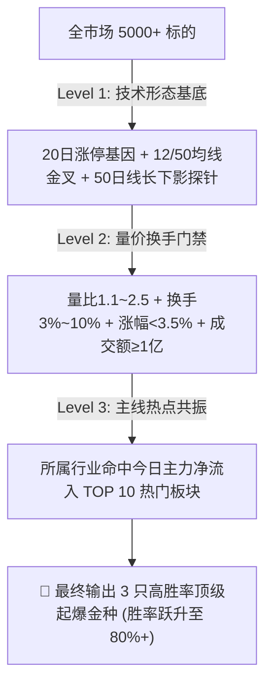

# 通达信 12/50 均线回踩起爆 · 主线共振狙击器 (TDX Pullback Sniper)

本 Skill 专用于捕捉具有**「涨停基因 + 中期均线反转 + 探针踩线企稳 + 温和放量健康换手 + 热门主线板块资金共振」**的顶级波段起爆标的。对标案例：**立方控股（920088.BJ）**。

---

## 一、三级量化深度滤网架构

A 股核心铁律：**“形态是骨骼，题材是血液，资金是灵魂”**。

### 1. 技术形态底座 (Level 1)
- 适配全市场涨停基因（主板10%、双创20%、北交所30%）：`COUNT(C >= ZTJ, 20) >= 1`；
- 12日线上穿50日均线，且处于金叉后 3~40 天内的健康上升周期；
- 近 3 日内至少出现 1 次探针长下影踩 50 日均线企稳动作。

### 2. 量价与换手门禁 (Level 2)
- **温和放量起爆**：量比 `1.1 <= volume_ratio <= 2.5`，杜绝无资金关注的死票与对倒出货票；
- **健康活跃换手**：换手率 `2.0% <= turnover <= 12.0%`，杜绝僵尸标的与高位筹码松动标的；
- **严格防追高**：日内涨幅处于 `0.0% ~ +3.5%`（微红点火黄金低吸点）；日内涨幅 `> 5.5%` 坚决一票否决；
- **防诱多大阴棒**：日内距最高点回撤 `<= 3.5%`，杜绝冲高回落套人假突破；
- **流动性底线**：日成交额必须 `>= 1.0 亿元`。

### 3. 主线热点板块共振 (Level 3 - 核心胜率放大器)
- 动态获取当日主力净流入 TOP 10 行业板块（如军工装备、软件开发、文化传媒/游戏、通信算力、电网设备等）；
- 命中今日主力抢筹热点主线的标的，直接加权 **+15 分**，享受全市场流动性溢价与龙头封板溢出效应；
- 彻底斩杀冷门孤儿股与跟风杂毛。

---

## 二、每日全自动调度机制

- **早盘 09:18 CST**：自动全市场扫描，飞书直推【主线热点共振顶级起爆卡】；
- **尾盘 14:18 CST**：自动筛选全天探针长下影托底、处于主线热点的尾盘低吸潜伏标的；
- **盘中随时调用**：发送“按通达信12/50回踩策略选股”即可触发。
